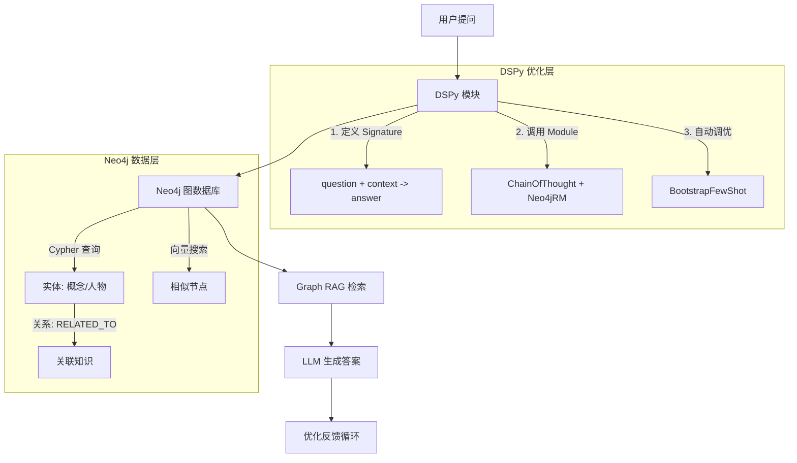
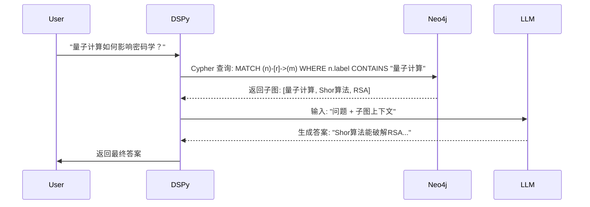

Here’s a step-by-step guide to building a **personal knowledge base** using **LLMs, Neo4j, Graph RAG, and DSPy**, with references to tools and examples from the web:

---

### **1. Core Components**
- **Neo4j**: Graph database to store structured knowledge (entities/relationships).
- **Graph RAG**: Retrieve contextual information by traversing the graph.
- **DSPy**: Optimize LLM prompts and retrieval logic programmatically.
- **LLM (e.g., GPT-4)**: Generate answers from retrieved context.

---

### **2. Step-by-Step Implementation**

#### **Step 1: Set Up Neo4j**
1. **Install Neo4j** ([Download Neo4j](https://neo4j.com/download/)).
2. **Define a Schema** for your knowledge base (e.g., `(Concept)-[RELATED_TO]->(Concept)`).
3. **Ingest Data**: Use Neo4j’s APOC or LLM-driven tools to extract entities/relationships from documents.

   *Reference*:  
   - [Neo4j GraphRAG Ecosystem Tools](https://www.imooc.com/article/377553)  
   - [LangChain-Neo4j Integration](https://www.langchain.com.cn/docs/integrations/providers/neo4j/)

#### **Step 2: Integrate DSPy for Graph Retrieval**
Use DSPy’s `Neo4jRM` module to retrieve relevant subgraphs based on user queries:
```python
from dspy.retrieve.neo4j_rm import Neo4jRM

# Initialize Neo4j retriever
neo4j_retriever = Neo4jRM(
    neo4j_uri="bolt://localhost:7687",
    index_name="vector_index",  # Enable vector search if needed
    text_node_property="text"   # Property containing text to retrieve
)

# Fetch context from Neo4j
context = neo4j_retriever("What is quantum computing?", k=3)
```

*Reference*:  
- [DSPy-Neo4j Knowledge Graph GitHub](https://github.com/chrisammon3000/dspy-neo4j-knowledge-graph)

#### **Step 3: Build a DSPy Pipeline**
Combine retrieval and generation with DSPy’s optimizers:
```python
class GraphQA(dspy.Signature):
    """Answer questions using Neo4j-retrieved context."""
    question = dspy.InputField()
    answer = dspy.OutputField(desc="Detailed, graph-informed response")

class GraphRAG(dspy.Module):
    def __init__(self):
        self.retrieve = Neo4jRM(neo4j_uri="bolt://localhost:7687")
        self.generate = dspy.ChainOfThought(GraphQA)

    def forward(self, question):
        context = self.retrieve(question).passages
        return self.generate(question=question, context=context)

# Optimize with DSPy
optimizer = dspy.BootstrapFewShot(metric=answer_accuracy)
compiled_rag = optimizer.compile(GraphRAG(), trainset=trainset)
```

*Reference*:  
- [DSPy Official Docs](https://dspy-docs.vercel.app/docs/getting-started)  
- [Optimizing LLMs with DSPy (Medium)](https://medium.com/@suvasism/dspy-llm-programming-language-d79a3dad3324)

#### **Step 4: Deploy the Pipeline**
1. Query the compiled pipeline:
   ```python
   response = compiled_rag("Explain quantum entanglement.")
   print(response.answer)
   ```
2. Iterate by refining signatures, retrieval logic, or adding more training examples.

---

### **3. Why DSPy?**
- **Automated Prompt Optimization**: DSPy tunes prompts/weights based on your data (e.g., few-shot examples).  
- **Modularity**: Swap Neo4j for other retrievers (e.g., FAISS) without rewriting prompts.  
- **Reproducibility**: Programs are version-controlled, unlike ad-hoc prompts.

*Comparison*:  
| Feature       | DSPy | LangChain | LlamaIndex |
|--------------|------|-----------|------------|
| **Prompt Optimization** | ✅ Auto-tuned | ❌ Manual | ❌ Manual |
| **Neo4j Integration** | ✅ Custom modules | ✅ Plugins | ✅ Plugins |
| **Graph-Aware Retrieval** | ✅ (via `Neo4jRM`) | Partial | Partial |

---

### **4. Advanced: Hybrid Search**
Combine **vector search** (for semantic similarity) and **graph traversal** (for relationships):
1. Use Neo4j’s `db.index.vector.queryNodes` for vector search.  
2. Filter results with Cypher queries (e.g., `MATCH (n)-[r]->(m) WHERE n.embedding IS SIMILAR TO $query`).

*Reference*:  
- [Neo4j Vector Search Docs](https://neo4j.ac.cn/labs/genai-ecosystem/vector-search/)  

---

### **5. Resources**
1. **Tutorials**:  
   - [DSPy RAG Example](https://github.com/stanfordnlp/dspy/blob/main/examples/rag/)  
   - [GraphRAG with Neo4j](https://www.dkmeco.com/community/blog/detail-112)  
2. **Tools**:  
   - [LangChain-Neo4j Graph Transformer](https://www.langchain.com.cn/docs/integrations/providers/neo4j/)  
   - [LLM Graph Builder](https://neo4j.ac.cn/labs/genai-ecosystem/llm-graph-builder/)  

---

### **6. Example Use Case**
**Task**: Answer complex questions like *"How does quantum computing affect cryptography?"*  
1. **Retrieve**: Neo4j fetches related concepts (e.g., "Shor’s algorithm", "RSA encryption").  
2. **Generate**: DSPy’s optimized LLM synthesizes an answer from the subgraph.  

以下是使用可视化图表（无需实际生成图片）解释 **DSPy + Neo4j + Graph RAG 知识库系统** 的架构和流程的文字描述，你可以用工具如 **Mermaid.js** 或 **Excalidraw** 绘制：

---

### **1. 系统架构图 (Mermaid.js 代码)**


---

### **2. 关键流程分步图解**
#### **步骤 1: 数据存储 (Neo4j)**
- **节点类型**: `Concept`, `Person`, `Document`  
- **关系类型**: `RELATED_TO`, `CITES`, `AUTHORED_BY`  
- **示例数据**:  
  ```plaintext
  (Quantum Computing)-[RELATED_TO]->(Shor's Algorithm)
  (Shor's Algorithm)-[BREAKS]->(RSA Encryption)
  ```

#### **步骤 2: DSPy 检索与生成**


#### **步骤 3: DSPy 自动优化**
- **优化目标**: 提升答案准确性  
- **方法**:  
  - `BootstrapFewShot`: 从历史数据中学习最佳示例  
  - `SignatureOptimizer`: 调整 prompt 措辞（如将“解释”改为“分步说明”）  

---

### **3. 可视化工具推荐**
1. **Mermaid.js**: 直接嵌入 Markdown 生成流程图 ([在线编辑器](https://mermaid.live/))  
2. **Excalidraw**: 手绘风格图表 ([示例模板](https://excalidraw.com/#json=1))  
3. **Neo4j Browser**: 可视化图数据库查询结果  

---

### **4. 图表要点标注**
- **红色框**: DSPy 的模块化组件（如 `Neo4jRM`）  
- **蓝色箭头**: 数据流（用户提问 → 检索 → 生成）  
- **绿色虚线框**: 自动优化循环  

如果需要具体图表设计或代码实现细节，可以进一步说明！
