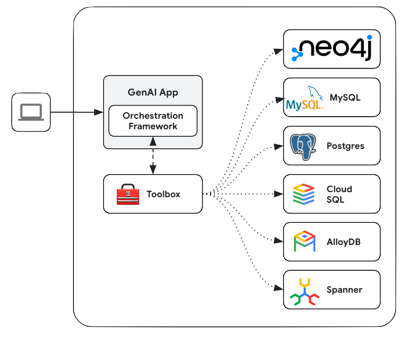
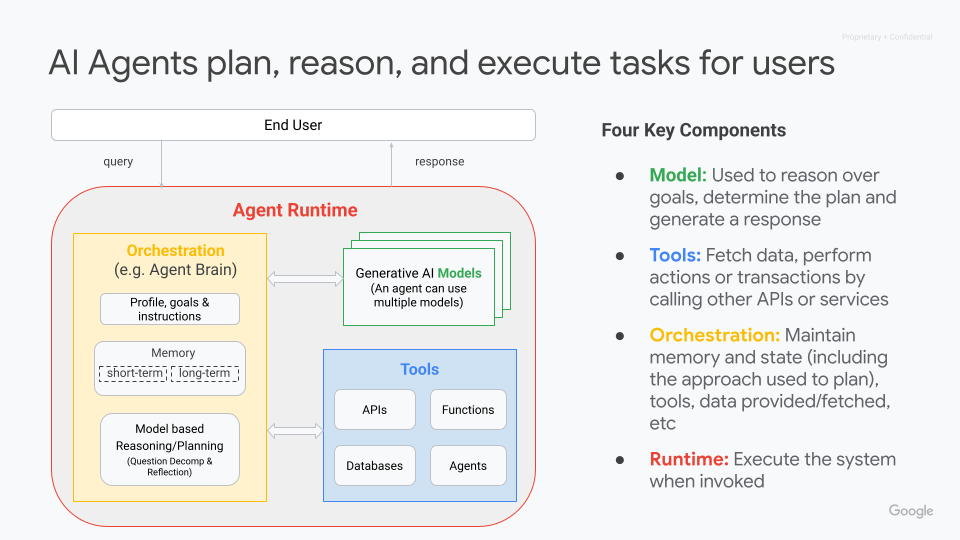
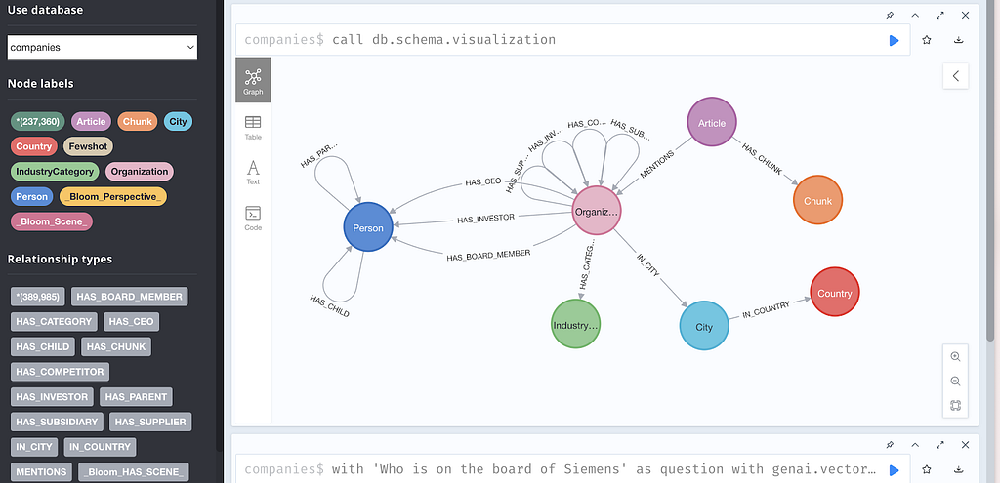

[Michael Hunger](https://medium.com/u/3865848842f9), Head of Product Innovation, Neo4j  
[Kurtis Van Gent](https://medium.com/u/f17c1f95a916), Staff Software Engineer, Google

> Interested in learning more? Watch the recording of the Gen AI Toolbox + Neo4j livestream:

## Introduction

The Gen AI Toolbox for Databases, recently [launched in collaboration with LangChain](https://cloud.google.com/blog/products/ai-machine-learning/announcing-gen-ai-toolbox-for-databases-get-started-today?e=48754805&hl=en), now includes a Neo4j integration.

This collaboration began following discussions with Kurtis Van Gent after the [GraphRAG gathering](https://neo4j.com/blog/developer/genai-graph-gathering/). There, he proposed better infrastructure to improve database integration in agentic systems as both sources and tools. The addition of Neo4j brings [knowledge graph](https://neo4j.com/whitepapers/developers-guide-how-to-build-knowledge-graph/) capabilities to Toolbox users, expanding the functionality for database management and Gen AI applications.



## Agentic Architectures

While you might have heard much about AI agents, here’s a quick recap of how they’re different from simple [retrieval-augmented generation](https://neo4j.com/blog/genai/what-is-retrieval-augmented-generation-rag/) (RAG) approaches and their implications.

### RAG Workflows

In traditional [**RAG**](https://cloud.google.com/use-cases/retrieval-augmented-generation?hl=en) flows, the user question isn’t answered by an LLM directly. Relevant information from trusted data sources is retrieved first and provided together with the question as part of the LLM prompt to be used for answering. So the LLM is only used for its language skills, not for the pretrained knowledge. This helps with the relevancy and accuracy of the answers and, partially, with explainability.

### GraphRAG Workflows

With [**GraphRAG**](https://graphrag.com/), a knowledge graph is the data source that goes way beyond text fragment retrieval from a vector store. The connected information in the graph provides relevant context from related entities, documents, and structural summaries. Due to the structured nature of the retrieved information, explaining and transparently showing the detailed sources of the answers also becomes  easier.

### Agentic

In **agentic architectures,** the LLM is equipped with tools for information retrieval and taking action on the user’s behalf. The LLM takes a more active role in analyzing and dissecting the question, creating a plan for using a set of tools to retrieve information for the different inputs and requested results, and executing it. During execution, the Agent-LLM can choose to call tools multiple times in sequence or loops or drill down into more complex information retrieval by using previously retrieved results as inputs for new tool calls. While running in the agentic loop, it observes if the data collected is sufficient to answer the user’s question and also applies guardrails and other techniques like re-ranking, judging, and selection by relevancy.



Agent architecture building blocks

Due to the structured analysis and parameter extraction for tool calls, the need for vector similarity search decreases. In general, the work of the LLM agent can be seen as similar to a query planning (and execution) process in the database world.

The tools made available to the agent have various options and shapes, from code execution in (Python) sandboxes to REST API calls to using databases for retrieval to using other LLMs — there are many possibilities. Most tools will be used for information retrieval or processing, and only a few per agent will allow updates and modifying actions.

Most LLMs already support tool calls via function calling, which allows you to pass in a list of signatures (name, description, parameters, results) of functions which the LLM then selects from and provides parameters for execution. Agent Frameworks add a lot of additional functionality — like guardrails, graph-based workflows, execution memory, and the aforementioned techniques.

While agents are a powerful mechanism that (as shown in the example below) is working surprisingly well even for answering complex questions and tasks and keeping conversations flowing smoothly, there are some challenges. These include:

* Tool configuration and description have to be consistent and sufficient for the LLM to make the correct choices.
* Tool execution management was often left to the developer, so depending on their familiarity with the data infrastructures, the resource management was suboptimal.
* Database query and other tools couldn’t be configured by data analysts as there was significant extra work (OpenAPI spec, function call signatures, Python code for execution) to be provided.
* The right tool has to be selected, so it needs to be clear from the name and description what each tool does and which sub-tasks it applies to.
* The tool has to be very specific about the kinds and data types of parameters, so the LLM can do conversions and translations before passing the parameters to the tools.
* Parameters need to be used in an injection-safe way to prevent code injections, which could lead to data exfiltration or unrestricted modifications.
* Vector search is less relevant in agentic setups as you will rarely pass the user question as a phrase to an embedding generation and vector similarity search, rather do structured parameter extraction and specific tool calls.

## Gen AI Toolbox

When it comes to creating tools that access databases, there are usually challenges that can be difficult to tackle with today’s orchestration frameworks: authentication, authorization, sanitization, connection pooling, and more. These challenges quickly become a burden, slowing development and leaving room for mistakes when repeatedly implementing the same boilerplate code.

Enter Toolbox — the open source server that makes it easier to build Gen AI tools for interacting with databases. It enables you to develop tools easier, faster, and more securely by handling connection pooling, authentication, and more. Toolbox lets you define the tools in a single location and integrate with your LangGraph agents in less than three lines of code:

```
from toolbox_langchain import ToolboxClient

# update the URL to point to your server  
client = ToolboxClient("http://127.0.0.1:5000")


# these tools can be passed to your agent!   
tools = await client.aload_toolset()


```

Toolbox is truly open source: as part of the launch, Google Cloud partnered with other database vendors, including Neo4j, to build support for a large number of open source and proprietary databases:

* PostgreSQL (including [AlloyDB](https://googleapis.github.io/genai-toolbox/resources/sources/alloydb-pg/) and [Cloud SQL for MySQL](https://googleapis.github.io/genai-toolbox/resources/sources/cloud-sql-mysql/))
* [MySQL](https://googleapis.github.io/genai-toolbox/resources/sources/mysql/) (including [Cloud SQL for MySQL](https://googleapis.github.io/genai-toolbox/resources/sources/cloud-sql-mysql/))
* [SQL Server](https://googleapis.github.io/genai-toolbox/resources/sources/mssql/) (including Cloud SQL for [SQL Server](https://googleapis.github.io/genai-toolbox/resources/sources/cloud-sql-mssql/))
* [Spanner](https://googleapis.github.io/genai-toolbox/resources/sources/spanner/)
* [**Neo4j**](https://googleapis.github.io/genai-toolbox/resources/sources/neo4j/)

We also have a number of features to help your application hit production more quickly — including built-in features such as support for [end-user authentication in tools](https://googleapis.github.io/genai-toolbox/resources/authsources/) and built in [observability](https://googleapis.github.io/genai-toolbox/concepts/telemetry/) through OpenTelemetry.

## Neo4j Cypher Sources and Tools

The Neo4j integration Google added to the Gen AI Toolbox supports the definition of sources and tools for Cypher execution. [Sources](https://googleapis.github.io/genai-toolbox/resources/sources/) represent how to connect to your Neo4j instance — things like URI, API key, etc. [Tools](https://googleapis.github.io/genai-toolbox/resources/tools/) represent specific actions your agent can take — such as reading or writing to a source.

[Neo4j](https://neo4j.com/genai) is the leading open source graph database — it manages information not as tables but as entities (nodes) and relationships between them, allowing a flexible and powerful representation of connected information. Graphs add unique capabilities for many domains like biomedical, supply chain, manufacturing, fraud detection, and transport logistics. [Knowledge graphs](https://neo4j.com/blog/what-is-knowledge-graph/), which you can think of as digital twins of your organization (people, processes, products, partners etc.) are a great “factual memory” companion to LLM’s language skills.

After [fetching the Toolbox binary](https://googleapis.github.io/genai-toolbox/getting-started/local_quickstart/#step-2-install-and-configure-toolbox), you can provide definitions for multiple Neo4j [**sources**](https://googleapis.github.io/genai-toolbox/resources/sources/neo4j/) by configuring your database connection details (URL, username, password) with named sources in a file called tools.yaml, provided to the Toolbox binary at startup.

Tools you define later are tied to a source, as in most cases, the queries are specific to the data model of that dataset.

```
sources:  
    my-neo4j-source:  
        kind: "neo4j"  
        uri: "neo4j+s://xxxx.databases.neo4j.io:7687"  
        user: "neo4j"  
        password: "my-password"  
        database: "neo4j"
```

[Tools](https://googleapis.github.io/genai-toolbox/resources/tools/) are specific statements that you want to execute against a source. To be usable with an agentic setup, it is really important to describe the tool, parameters, and results in enough detail so that the LLM can reason about its applicability.

Statements in tools can be **generic** — like fetching a single entity by a predicate, getting the first- or second-degree neighborhood, or even finding the shortest paths between entities. They can be **specific**, written by a subject-matter expert, following a more complex set of paths in your data, (retrieving the gene or protein expression targets of a drug or getting product recommendations for a user, for example). Tools can also **update data** in the graph by updating attributes or adding nodes and relationships representing business concepts.

But tools can also make use of advanced functionality like running graph algorithms for clustering, doing spatial operations, or executing vector similarity or full-text search for text phrases.

Below, you see a simple example of a [neo4j-cypher tool](https://googleapis.github.io/genai-toolbox/resources/tools/neo4j-cypher/) retrieving a set of movies by actor and starting release year. Note the detailed description of the tool and the parameter. That allows the LLM to reason and choose the right tool at each step of the planning and execution.

Each tool has the following configuration:

* A name
* An associated source
* The Cypher query statement using parameters, doing the graph pattern match, and returning results
* Description of the tool/query
* Name, type, and description of each parameter

```
tools:  
 search_movies_by_actor:  
    kind: neo4j-cypher  
    source: my-neo4j-movies-instance  
    statement: |  
      MATCH (m:Movie)<-[:ACTED_IN]-(p:Person)  
      WHERE p.name = $name AND m.year > $year  
      RETURN m.title, m.year  
      ORDER BY m.year DESC  
      LIMIT 10  
    description: |  
Use this tool to get a list of movies for a specific actor and a given minimum   
 release year. Takes a full actor name, e.g. "Tom Hanks" and a year e.g 1993  
 and returns a list of movie titles and release years.  
Do NOT use this tool with a movie title. Do NOT guess an actor name,   
 Do NOT guess a year. An actor name is a fully qualified name with first and   
 last name separated by a space.  
For example, if given "Hanks, Tom" the actor name is "Tom Hanks".  
If the tool returns more than one option choose the most recent movies.  
      Example:  
      {{  
          "name": "Meg Ryan",  
          "year": 1993  
      }}  
      Example:  
      {{  
          "name": "Clint Eastwood",  
          "year": 2000  
      }}  
    parameters:  
      - name: name  
        type: string  
        description: Full actor name, "firstname lastname"  
      - name: year  
        type: integer  
        description: 4 digit number starting in 1900 up to the current year 
```

## Investment Research Agent

This is a demonstration of an agentic LangChain application with Tools that use GraphRAG patterns combining full-text and graph search.

The example represents an **investment research agent** that can be used to find recent news about companies, their investors, competitors, partners, and industries. It is powered by data from the Diffbot knowledge graph that was imported into Neo4j.

The code for the example can be found in [this repository](https://github.com/jexp/toolbox-companies).

## Companies and Articles: Diffbot Dataset

The dataset is a graph about companies, associated industries, people that work at or invested in the companies, and articles that report on those companies.



Article, industry, and company graph

The news articles are chunked, and the chunks are also stored in the graph.

The database is publicly available with a read-only user. You can explore the data at <https://demo.neo4jlabs.com:7473/browser/>.

* URI: neo4j+s://demo.neo4jlabs.com
* User: companies
* Password: companies
* Companies: companies

We use the agentic LangChain integration with Vertex AI, which allows us to pass the tools we registered with Toolbox automatically to the LLM for tool calling. We will use hybrid search, as well as parent-child retrievers and GraphRAG (extract relevant context).

In our configuration, we provide tools that make use of the full-text index, as well as graph retrieval queries, which fetch the following additional information:

* Parent article of the Chunk (aggregate all chunks for a single article)
* Organization(s) mentioned
* IndustryCategory(ies) for the Organization
* Person(s) connected to the Organization and their roles (e.g., Investor, Chairman, CEO)

## Tools

These are the tools with specific queries that we make available in Toolbox for the agent to use.

Each tool takes parameters from the agent, executes a graph query, and returns structured results:

* industries — List of industry category names
* companies\_in\_industry — Companies (ID, name, summary) in a given industry by industry
* companies — List of companies (ID, name, summary) by full-text search
* articles\_in\_month — List of articles (ID, author, title, date, sentiment) in a month timeframe from the given date (yyyy-mm-dd)
* article — Single article details (ID, author, title, date, sentiment, site, summary, content) by article ID
* companies\_in\_articles — Companies (ID, name, summary) mentioned in articles by list of article IDs
* people\_at\_company — People (name, role) associated with a company by company ID

## Configuration in Toolbox

### Neo4j Source Configuration

In the sources section of our tools.yaml file, we configure the public Neo4j companies graph database connection as a source:

```
sources:  
    companies-graph:  
        kind: "neo4j"  
        uri: "neo4j+s://demo.neo4jlabs.com"  
        user: "companies"  
        password: "companies"  
        database: "companies"
```

## Neo4j Cypher Tools Setup

Now we can configure the first two tools we want to test with the Toolbox; the other tools will be configured and described in a similar way as shown below:

* industries — List of industry names
* companies\_in\_industry — Companies (ID, name, summary) in a given industry by industry

```
tools:  
  industries:  
    kind: neo4j-cypher  
    source: companies-graph  
    statement: |  
      MATCH (i:IndustryCategory)   
      RETURN i.name as industry  
    description: List of Industry names

companies_in_industry:  
    kind: neo4j-cypher  
    source: companies-graph  
    statement: |  
      MATCH (:IndustryCategory {name:$industry})<-[:HAS_CATEGORY]-(c)   
      WHERE NOT EXISTS { (c)<-[:HAS_SUBSIDARY]-() }  
      RETURN c.id as company_id, c.name as name, c.summary as summary  
    description: Companies (company_id, name, summary) in a given industry by industry  
    parameters:  
      - name: industry  
        type: string  
        description: Industry name to filter companies by


```

After starting Toolbox with our YAML configuration file, it serves the tool definitions via an API, which can be retrieved with the ToolboxClient and passed to LangChain:

```
# one of linux/amd64, darwin/arm64, darwin/amd64, or windows/amd64  
export OS="linux/amd64"   
curl -O https://storage.googleapis.com/genai-toolbox/v0.1.0/$OS/toolbox  
chmod +x toolbox

./toolbox --tools_file tools.yaml  
2025-02-13T13:50:22.052198+01:00 INFO "Initialized 1 sources."   
2025-02-13T13:50:22.052967+01:00 INFO "Initialized 0 authSources."   
2025-02-13T13:50:22.053095+01:00 INFO "Initialized 2 tools."   
2025-02-13T13:50:22.053146+01:00 INFO "Initialized 1 toolsets."   
2025-02-13T13:50:22.053742+01:00 INFO "Server ready to serve!"


```

We can now use LangChain with the Gemini 2.0 Flash model and feed our tool definitions to the Model to do a quick test. We can follow the [Quickstart example](https://googleapis.github.io/genai-toolbox/getting-started/local_quickstart/#step-3-connect-your-agent-to-toolbox) in the Toolbox documentation.

```
import asyncio  
import os

from langgraph.prebuilt import create_react_agent  
from langchain_google_vertexai import ChatVertexAI  
from langgraph.checkpoint.memory import MemorySaver


from toolbox_langchain import ToolboxClient


prompt = """  
  You're a helpful investment research assistant.   
  You can use the provided tools to search for companies,   
  people at companies, industries, and news articles from 2023.  
  Don't ask for confirmations from the user.  
  User:   
"""


queries = [  
    "What industries deal with computer manufacturing?",  
    "List 5 companies in the computer manufacturing industry with their   
     description.",  
]


def main():  
    model = ChatVertexAI(model_name="gemini-1.5-pro")


client = ToolboxClient("http://127.0.0.1:5000")  
    tools = client.load_toolset()


agent = create_react_agent(model, tools, checkpointer=MemorySaver())


config = {"configurable": {"thread_id": "thread-1"}}  
    for query in queries:  
        inputs = {"messages": [("user", prompt + query)]}  
        response = agent.invoke(inputs, stream_mode="values", config=config)  
        print(response["messages"][-1].content)


main()


```

The outputs we get are:

```
The industries that deal with computer manufacturing are:   
Computer Hardware Companies, Electronic Products Manufacturers,   
and Computer Storage Companies.

Here are 5 companies in the computer hardware industry along with their   
descriptions:


1.  **Microsoft Egypt:** Microsoft branch in Egypt  
2.  **Apigee:** Software company based in San Jose, California, United States and owned by Google  
3.  **Microsemi:** Communications corporation  
4.  **Intermec:** American electronics manufacturing company  
5.  **Elitegroup Computer Systems:** No summary available


```

Now that this works, we can add the other tools as well:

* companies — List of companies (ID, name, summary) by full-text search
* articles\_in\_month — List of articles (ID, author, title, date, sentiment) in a month timeframe from the given date (yyyy-mm-dd)
* article — Single article details (ID, author, title, date, sentiment, site, summary, content) by article ID
* companies\_in\_articles — Companies (ID, name, summary) mentioned in articles by list of article IDs
* people\_at\_company — People (name, role) associated with a company by company ID

Please note that to handle array parameters, you have to provide an “items” subgroup that specifies the sub-type and description:

```
tools:

companies:  
    kind: neo4j-cypher  
    source: companies-graph  
    statement: |  
      CALL db.index.fulltext.queryNodes('entity', $search, {limit: 100})   
      YIELD node as c, score WHERE c:Organization   
      AND NOT EXISTS { (c)<-[:HAS_SUBSIDARY]-() }  
      RETURN c.id as company_id, c.name as name, c.summary as summary  
    description: List of Companies (company_id, name, summary) by fulltext search  
    parameters:  
      - name: search  
        type: string  
        description: Part of a name of a company to search for


articles_in_month:  
    kind: neo4j-cypher  
    source: companies-graph  
    statement: |  
      MATCH (a:Article)  
      WHERE date($date) <= date(a.date) < date($date) + duration('P1M')  
      RETURN a.id as article_id, a.author as author, a.title as title, toString(a.date) as date, a.sentiment as sentiment  
      LIMIT 25  
    description: List of Articles (article_id, author, title, date, sentiment) in a month timeframe from the given date  
    parameters:  
      - name: date  
        type: string  
        description: Start date in yyyy-mm-dd format


article:  
    kind: neo4j-cypher  
    source: companies-graph  
    statement: |  
      MATCH (a:Article)-[:HAS_CHUNK]->(c:Chunk)  
      WHERE a.id = $article_id  
      WITH a, c ORDER BY id(c) ASC  
      WITH a, collect(c.text) as contents  
      RETURN a.id as article_id, a.author as author, a.title as title, toString(a.date) as date,  
      a.summary as summary, a.siteName as site, a.sentiment as sentiment, apoc.text.join(contents, ' ') as content  
    description: Single Article details (article_id, author, title, date, sentiment, site, summary, content) by article id  
    parameters:  
      - name: article_id  
        type: string  
        description: ID of the article to retrieve


companies_in_articles:  
    kind: neo4j-cypher  
    source: companies-graph  
    statement: |  
      MATCH (a:Article)-[:MENTIONS]->(c)  
      WHERE a.id = $article_id AND not exists { (c)<-[:HAS_SUBSIDARY]-() }  
      RETURN c.id as company_id, c.name as name, c.summary as summary  
    description: Companies (company_id, name, summary) mentioned in articles by article id  
    parameters:  
      - name: article_id  
        type: string  
        description: Article id to find companies mentioned in


people_at_company:  
    kind: neo4j-cypher  
    source: companies-graph  
    statement: |  
      MATCH (c:Organization)-[role]-(p:Person) WHERE c.id = $company_id  
      RETURN replace(type(role),"HAS_","") as role, p.name as person_name, c.id as company_id, c.name as company_name  
    description: People (person_name, role, company_id, company_name) associated with a company by company id  
    parameters:  
      - name: company_id  
        type: string  
        description: Company id to find associated people for


```

## Using the Agent — Conversation

I’ve been impressed by the following conversations and the ability of the LLM to use the tools correctly until all information to answer the question has been collected.

The LLM is able to not only use the endpoints once but also refer back to information from the conversation history and ensure that the relevant context is taken into account.

It can fix misspelled or incorrect parameters to their correct content, reformat dates in the required shape, and more. API functions are called multiple times and also cascade if needed. For instance, retrieve a list of IDs for a certain context and then make individual calls for each ID to retrieve details.

It is also able to resolve pronouns and demonstratives (e.g., “these” is resolved to a concrete list of company IDs or articles that are then used to make multiple API calls).

I’ll comment on each question about what the trickiness is and how the LLM agent resolved it.

Let’s look at some more questions to our research agent and see how it fares:

* What five industries deal with neurological implants?
* List three companies from those industries with their description and filter afterward by California.
* Who is working at these companies?
* Which companies are mentioned in the news in January 2023 with positive sentiment?
* Who is working there as board members?

### Answers

**What five industries deal with neurological implants?**

*Initially, we do an easy one — the task here is to call the industries endpoint, but then only limit it to five results (the endpoint takes no limit argument). Also, we’re vague about the actual industry.*

Based on the available industries, the following seem most relevant to neurological implants:

* Medical technology companies
* Healthcare companies
* Biotechnology companies
* Pharmaceutical companies
* Robotics companies

**List three companies from those industries with their description and filter afterward by California.**

*Using prior information, fixing parameters, and post-filtering. Here in this question, we provide general back-reference to the industries and an additional location that is not a parameter but needs to be post-filtered.*

*It uses the prior information in the conversation to fix the industry name and applies the post-filter and limit to only show three California companies.*

OK, I have a lot of companies. I will filter for companies located in California, then list five of them with their descriptions:

* **goBalto:** (biotechnology companies, pharmaceutical companies) Software company based in San Francisco, California, United States
* **Quantenna Communications:** (semiconductor companies, electronic products manufacturers) Manufacturing company based in San Jose, California, United States and owned by ON Semiconductor
* **…**

**Who is working at these companies?**

*In our next question, we reference back with a “these” for the companies and ask for details that are available in a separate endpoint. But the agent has to call the people\_at\_company endpoint multiple times, as it only takes a single company ID.*

Here are some people working at the listed companies:

* **goBalto:** Sujay Jadhav (CEO), Darren Hite (BOARD\_MEMBER), Masashi Kiyomine (BOARD\_MEMBER)
* **Quantenna Communications:** Sam Heidari (CEO), Dmitry Akhanov (BOARD\_MEMBER), Edwin B Hooper III “Ned” (BOARD\_MEMBER), Jack Lazar (BOARD\_MEMBER), Mark Stevens (BOARD\_MEMBER)
* **Finisar:** Bob Bashaw (CEO), Mary Jane Raymond (BOARD\_MEMBER)
* **…**

**Which companies are mentioned in the news in January 2023 with positive sentiment?**

*Here, we want to do two things, switching the conversation from companies to articles without restarting the session. We give a partial date of January 2023, which has to be converted to the format yyyy-mm-dd for the API call. It has to understand that “good sentiment” refers to the numeric score and that we want to have the highest score. The list of articles that come with sentiment output, the model needs to read, understand, sort by sentiment descending, select the highest-ranked articles, and output their titles and the companies mentioned in these. It is not the same endpoint, so it needs to take the article IDs and check the companies\_in\_article tool for each article individually.*

Here are the articles from January 2023 with positive sentiment scores and the companies they mention:

* **BackBox Unveils Customized Product Updates (0.886):** I don’t have the tools to identify the companies mentioned in this article.
* **Mozilla’s Pocket App Just Got a Big Update (0.838, 0.83):** Mozilla
* **Onapsis and Wipro help enterprises secure their SAP applications (0.612):** Onapsis, Wipro, SAP
* **Onapsis Announces Collaboration with Wipro to Remove Security as a Digital Transformation Roadblock (0.804, 0.735):** Onapsis, Wipro
* **Houston Metro and Lone Star college launch new pilot service for Lone Star College-Houston North Fallbrook campus (0.816):** Lone Star College
* **…**

**Who is working there as board members?**

*Here, we refer back to the companies from before with “there” and also specify the roles requirement for the API call choice only vaguely. The agent needs to call the people\_at\_company endpoint multiple times with the IDs of the companies retrieved earlier in the session history, then aggregate and filter the information into the response.*

I wasn’t able to retrieve board members for all of the companies. Here’s the information I found:

* **Wipro:**Azim Premji (BOARD\_MEMBER)  
  Rishad Premji (BOARD\_MEMBER)
* **SAP:**Hasso Plattner (BOARD\_MEMBER)  
  Jennifer Morgan (BOARD\_MEMBER)
* **Google:**Larry Page (BOARD\_MEMBER)  
  Sergey Brin (BOARD\_MEMBER)

## Deployment

The deployment of the Toolbox server and the LangGraph application is outside the scope of this article. Please refer to the [documentation for GenAI Toolbox](https://googleapis.github.io/genai-toolbox/how-to/deploy_toolbox/) and [LangChain on Cloud Run](https://codelabs.developers.google.com/codelabs/build-and-deploy-a-langchain-app-on-cloud-run).

## Summary

We’ve demonstrated how you can build agentic applications that integrate database-based tools easily with the Google Gen AI Toolbox. While we focused on a [GraphRAG](https://graphrag.com/) use case with a knowledge graph in Neo4j, you can combine different data sources and types of databases in the same agentic application. Since Toolbox integrates with different agent frameworks, you can define your tools once and reuse them for several use cases. Being open source, it was straightforward to contribute to Toolbox. We hope you will make use of the [feedback and discussion mechanisms](https://github.com/googleapis/genai-toolbox) to add your own data sources and provide feedback and improvements.

You can learn more about knowledge graphs in [What Is a Knowledge Graph?](https://neo4j.com/blog/genai/what-is-knowledge-graph) And be sure to check out [What Is GraphRAG?](https://neo4j.com/blog/genai/what-is-graphrag/)


---

[Building AI Agents With the Google Gen AI Toolbox and Neo4j Knowledge Graphs](https://medium.com/neo4j/building-ai-agents-with-the-google-gen-ai-toolbox-and-neo4j-knowledge-graphs-86526659b46a) was originally published in [Neo4j Developer Blog](https://medium.com/neo4j) on Medium, where people are continuing the conversation by highlighting and responding to this story.

## The Developer’s Guide: How to Build a Knowledge Graph

This ebook gives you a step-by-step walkthrough on building your first knowledge graph.