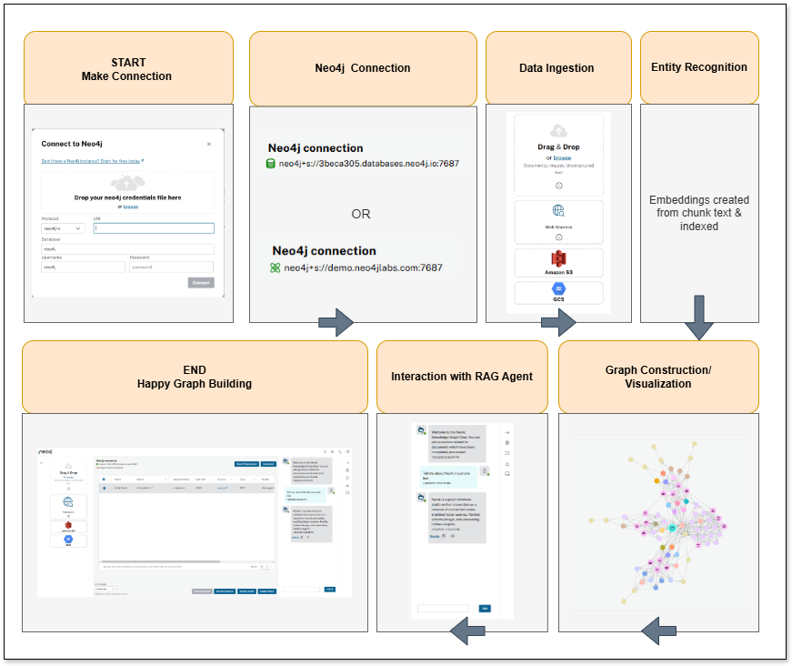
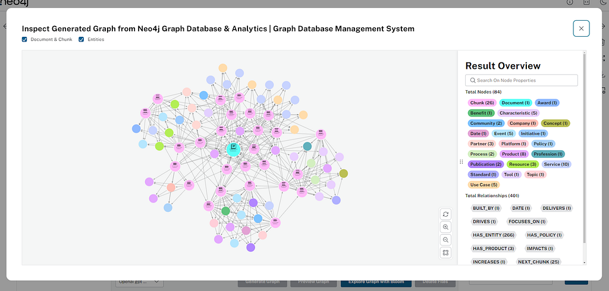

*Written by* [*Kartik Joshi*](https://medium.com/u/159f9833c07e) *and* [*Prakriti Solankey*](https://medium.com/u/193b909cb13d)*— March 16, 2025*

The [Neo4j LLM Knowledge Graph Builder](https://llm-graph-builder.neo4jlabs.com/) provides a user-friendly interface that simplifies uploading PDF files and other web sources and generating graphs using LLMs. Additionally, it offers a chat experience using the generated knowledge graph with [GraphRAG](https://neo4j.com/blog/genai/what-is-graphrag/) retrievers. This blog post focuses on the tool’s front-end architecture. (Get a step-by-step walkthrough on building your first knowledge graph in [The Developer’s Guide: How to Build a Knowledge Graph](https://neo4j.com/whitepapers/developers-guide-how-to-build-knowledge-graph/).)

[Image failed to download: https://dist.neo4j.com/wp-content/uploads/20250318111924/1qGubO58D0BnYjwy\_EYjLaw.png]

Check out a quick video showing how to use the tool:

## Getting Started

The LLM Knowledge Graph Builder UI uses React for application logic and components, Axios for handling network calls and responses, and long polling or server-sent events (SSEs) for real-time data updates. Tailwind CSS, based on Neo4j’s Needle Design System, or styled-components handles the CSS design.

The React Context API does the state handling. The UI guides users through each step of the knowledge graph-building process and chat experience, making it accessible and easy for users with varying levels of technical expertise.

### UI Architecture and Components

Flow and architecture

For the LLM Knowledge Graph Builder, we use the following technologies:

* **React**— Application logic
* **Axios**— For network calls and handling responses
* **styled-components** — To handle CSS in JavaScript, where we write all CSS; or Tailwind CSS, which provides third-party CSS classes to speed development
* **Long polling** — Long polling is a simple way to maintain a steady connection between a client and a server. It holds the request for a period of time if there is no response. It regularly updates clients with new information, updating status and processing chunks every minute with new data.
* **SSE**—Server-side events are the best option when the server generates data in a loop and sends multiple events to the clients, or if we need real-time traffic from the server to the client.
* **React Context API** — For state handling; since the application is not complex, we are using the context API for global state management.

#### Needle Design System

We used the Neo4j [Needle Design System](https://www.neo4j.design/), which is used for all Neo4j UIs, product tools, and web pages. Accordingly, it adheres to industry-standard guidelines of the web, such as web accessibility, and provides user-friendly design tokens, colors, and components that we integrated into our application. Additionally, it includes patterns followed in the application and common UX writing standards.

Needle Design System

The [Neo4j Needle starter kit](https://github.com/neo4j-labs/neo4j-needle-starterkit) helped us speed up the development. The responsive starter kit is used to build applications with the Neo4j Needle Design System to accelerate time to value of Neo4j-powered front-end applications. Furthermore, it provides basic extensible components, which can be adapted according to the functionality.

A user-friendly interface guides users through connecting to Neo4j Aura, accessing file sources, uploading PDF files, generating graphs, visualizing graphs, and the chat interface:

* [Neo4j Needle Design System](https://neo4j.design/) components
* [Neo4j Visualization Library](https://neo4j.com/docs/nvl/current/)
* CSS: Inline styling with [Tailwind CSS](https://tailwindcss.com/)

The Needle Design System supports themes (like dark and light) out of the box, which makes developers’ lives easier.

Dark theme

Light theme

## Usage Flow

User flow diagram

### Steps

#### Step 1. Start Connection

User action: The user initiates the process by starting the application. This is where they might open the tool and begin to interact with the UI.

#### Step 2. Neo4j Connection

User action: The user provides the necessary credentials and connection details to establish a connection with the Neo4j database. This is where they would specify the host, port, username, and password to reach the intended database instance.

#### Step 3. Data Ingestion

User action: The user uploads or specifies the sources of data. This includes:

* Local files — Dragging and dropping files (like PDFs, DOCX, TXT, and images)
* Web links — Inputting URLs for websites, YouTube videos, or Wikipedia pages
* Cloud storage — Configuring access to Amazon S3 or Google Cloud Storage buckets

#### Step 4. Entity Recognition

User action: The system processes ingested data using an LLM to identify entities (key objects, concepts, etc.) and the relationships between those entities. This is where the LLM looks at the content and begins to identify and extract relevant information from the documents.

#### Step 5. Graph Construction

User action: The entities and relationships recognized in the previous step are used to construct the knowledge graph in the Neo4j database. This includes determining the nodes (entities) and the edges (relationships) that comprise the graph database.

#### Step 6. Visualization

User action: The user can now visualize the constructed graph. Options include:

* Document and chunk — Shows the connections between documents and text chunks
* Entity Graph — Displays relationships among identified entities
* Communities — Presents community summaries for entity clusters
* The user can also explore the graph using Neo4j Bloom for more advanced analysis, querying, and editing

#### Step 7. Interaction With RAG Agent

User action: The user interacts with the chatbot by asking questions. The application uses retrieval-augmented generation (RAG) to retrieve relevant information from the knowledge graph and generate answers. The user can select between a vector-only or GraphRAG method. They can additionally access details about how the RAG agent retrieved and used source material. The user may interact with the bot, asking questions and refining the inquiries.

#### Step 8. End

User action: The user has completed their interaction. This might involve closing the app, exploring the graph, building an application to use the data, or exporting data.

## UI Walkthrough

### Neo4j Connection

Users connect with the Neo4j database by adding details like protocol, URI, database name, username, and password. You can alternatively just drop the credentials file downloaded when creating your Aura or Sandbox instance on the connection dialog to populate the form with robust error handling.

Connection dialog

### File Upload

Users can upload different types of files, including:

* Microsoft Office (.docx, .pptx, .xls, .xlsx)
* PDF (.pdf)
* Images (.jpeg, .jpg, .png, .svg)
* Text (.html, .txt, .md)

These will convert to a Document node by creating chunks using the file content. Files greater than CHUNK SIZE (5MB) will be divided into binary chunks and sent to the server. On the server side, all chunks will be merged and processed for document node creation. CHUNK SIZE is configurable through the Docker file configuration.

File upload

### Web Sources

Users can provide web sources such as Wikipedia, YouTube videos, and web URLs (e.g., for articles), which are processed using the [Unstructured LangChain loader](https://python.langchain.com/docs/integrations/providers/unstructured/). The Document node is created, and the text Chunk is created by processing the contents of the sources according to the configuration.

Web sources

### Cloud Provider Storage

Users can provide the sources for bulk upload from Amazon S3 and Google Cloud Storage.

For S3, the user needs to provide their access key, secret key, and S3 URL. By submitting these credentials, all the PDF files found in the bucket and folder will be imported, and Document nodes will be created for each file along with its contents as Chunk nodes.

**Amazon S3:**

Aws S3 cloud storage

**Google Cloud Storage:**

Users need to provide the project ID, bucket name, and folder. Subsequently, they get a redirect flow to an authentication page to authenticate their Google account to gain access to the bucket.

Google Cloud Storage bucket

### LLM Selection

We support [various models](https://neo4j.com/labs/genai-ecosystem/llm-graph-builder-features/). Users can choose any additional model that supports an OpenAI API and configure it by providing the keys in their configuration. The currently selected model will be used for extraction, post-processing, and retrieval, chat, and evaluation purposes. For the latter, you can instead switch the model as needed.

[Image failed to download: https://dist.neo4j.com/wp-content/uploads/20250318111900/1y4TphUgjOqD3dyuVF5Tr5g.png]

LLM drop-down

To process the documents, users need to click the **Generate Graph** button, which starts the extraction process using the [**LLM Graph Transformer**](https://medium.com/towards-data-science/building-knowledge-graphs-with-llm-graph-transformer-a91045c49b59) tool from LangChain. During extraction, the selected files or all files in the new state go into processing state, and then completed state if no failures.

To update the processing progress, we use server-side events where the server will stream the document status by reading it from the database in real time. And on the client side, we update the state on every progress change with minimal re-rendering to ensure the performance standards.

We created a custom hook, which will be used across the components to update the processing progress. Additionally, we implemented batch-wise processing, which means if a user selects more than two files, then only two files (configurable) will be processed at a time to reduce the back-end load for the publicly deployed version. We then created a queue state to maintain the order. The batch size is configurable through the Docker env.

Graph extraction

Users can reprocess the failed or canceled files by selecting the desired option to reprocess by clicking on the reprocess icon (**↻**). The status will change to Ready for Reprocess. Users can then reprocess multiple files by clicking the **Generate Graph** button.

[Image failed to download: https://dist.neo4j.com/wp-content/uploads/20250318111852/1XANr5rW6J\_yYTbJeN2uYHg.png]

Reprocess failed or canceled documents

There are three ways a user can reprocess:

* Start over
* Delete entities and start over
* Start from the last processed chunk

Reprocess option

## LLM Knowledge Graph Builder Graph Visualization

For graph visualization, we’re using the InteractiveNvlWrapper component from the [Neo4j Visualization Library](https://neo4j.com/docs/nvl/current/), which provides flexibility and handlers to integrate the graph visualization according to the business logic. We created a reusable component used to render the graph in various stages of the application.

We’re hitting the back-end API once to get the nodes and relationships from the database and and apply filters locally to have a faster user experience.

Users can click on nodes to view details about the node — type, attributes, etc. Additionally, we implemented client-side search functionality, where users can search for specific nodes by label or order text. We support minor visualization actions such as zoom in/out and refresh graph, which is useful while the document processing is under way.

We’ll publish a separate blog post in this series where we dive deeper into the intricacies of graph visualization and how we addressed them.

Graph visualization

### Graph Enhancements

We support a number of processing enhancements, where users can configure settings like set a custom graph schema for extraction, get additional instructions for guided extraction, interactively remove orphan nodes, merge duplicate nodes (by similarity).

Users can provide their schema, use existing schema examples, or load the current schema for the Neo4j database.

Entity extractions tab

We support schema extraction from a provided text example (up to several pages) through an LLM. This also works for schema description metadata (think RDF ontologies, CREATE TABLE statements, or just verbal descriptions), but also for sample sections of the document to process.

This can consequently speed up the generation of a candidate graph model that then can be refined or cleaned up by the user.

[Image failed to download: https://dist.neo4j.com/wp-content/uploads/20250318111846/1o3\_LL6d8HS5moD6JQx3nzw.png]

Schema extraction from text

#### Additional Instructions

Additional instructions are used to refine the knowledge graph by adding additional guidelines for the extraction prompt. You can instruct the model to only focus on current events or ignore certain types of technologies or organizations, or to provide additional contextual information like glossaries or domain information.

#### Chunking Configuration

Optional configuration for the chunking process:

• **Token count per chunk** defines the number of tokens processed in each chunk (set to default 200).  
• **Chunk overlap** specifies overlapping tokens between chunks to maintain context (set to default 20).  
• **Chunks to combine** determines how many chunks are merged for processing (set default to 1).

[Image failed to download: https://dist.neo4j.com/wp-content/uploads/20250318111840/1xLDalMxCP6-HTJYw4dObDg.png]

Additional instructions tab

#### Deleting Disconnected (Orphan) Nodes

Users can list and delete disconnected nodes interactively, which are not connected to any other entity (just to chunks or communities).

[Image failed to download: https://dist.neo4j.com/wp-content/uploads/20250318111833/1w8SkgEQB-3nh-oV-2pi5sA.png]

Orphan nodes removal tab

#### De-duplication of Nodes

Users can merge similar entities to eliminate redundancy and improve the accuracy and clarity of the knowledge graph. We use a combination of vector and text distance similarity to group the candidates. You can remove individual nodes before merging the selected rows of nodes.

De-duplication tab

#### Post-Processing Jobs

Users can select which jobs can run after the extraction process, which will improve features like GraphRAG out of the box. We do support the Graph Data Science (GDS) and non-GDS instances, so we will show the communities option:

* **Materialize text chunk similarities:** Create SIMILAR relationships between text chunks whose vector similarity exceeds a configured threshold.
* **Enable hybrid search:** Create a full-text index for entities for hybrid search and full-text search in Neo4j Bloom.
* **Materialize entity embeddings:** Generate embeddings for entities.
* **Enable communities:** On a GDS-enabled database instance, compute entity clusters and generate hierachical community summaries.
* **Graph schema consolidation:** If no graph schema is configured, subsequently attempt to consolidate and clean up the automatically generated graph with an LLM call.

[Image failed to download: https://dist.neo4j.com/wp-content/uploads/20250318111823/134d42a7knpVppCMWqZUVFQ.png]

Post-processing jobs tab

#### Table Filters

Users can sort and filter the documents table based on properties like extraction status, source type, model type, etc.

Table filters

## Chatbot With Different Retriever Modes

### Retriever Modes

We support various retrieval modes to analyze the power of graphs, vector search, entity search, and the [GraphRAG](https://graphrag.com/) implementation. Users can select one or more retrievers for the chat and switch between chat results for each to visually see the difference in the generated answers.

### Chat Views and Functions

We support two views for the chat feature. Users can chat within the main UI sidebar, or in the separate modal for a better experience. Additionally, users can listen to answers, copy it, and download the conversation in JSON format.

Chatbot integration and retriever selection

Chatbot expanded view

### Chat-Only Mode

To interact with your data in a Neo4j database through conversational queries, and also retrieve metadata about the source of response to your queries with a dedicated chat-only UI.

For a dedicated chat interface, access the stand-alone chat application at the chat-only route. This link provides a focused chat experience for querying your data.

[Image failed to download: https://dist.neo4j.com/wp-content/uploads/20250318111815/1cpLHYFssjWAskyuHNZ8TdQ.png]

Chat-only mode

### Retrieval Insights

We support explainability of chat answers, which allows users to verify the actual answer sources and entities retrieved from the graph database and used by the LLM to generate the answer.

You can see them by clicking on **Details**. In the pop-up, we not only show information about the retrieval mode, model, tokens, and runtime but also chunks, entities, communities that have been used to generate the answer.

Users can visualize the neighborhood context of the text chunks and entities and can download the insights in JSON format.

[Image failed to download: https://dist.neo4j.com/wp-content/uploads/20250318111808/1NgUm549ORKPjLzK62m9JZA.png]

Sources used tab

[Image failed to download: https://dist.neo4j.com/wp-content/uploads/20250318111801/1ooyzkM-lOorw3OBPM778PA.png]

Entities used tab

### Ragas Evaluation Metrics

Users can measure/validate the answer accuracy across all retrievers through the [Ragas](http://github.com/explodinggradients/ragas/) evaluation pipeline by clicking the **View Detailed Metrics** button. Ragas is an evaluation tool to measure the quality of the RAG system response through an LLM and the ground-truth answer, which can be provided for additional metrics.

[Image failed to download: https://dist.neo4j.com/wp-content/uploads/20250318111755/1K2ZIAS3TYBi6wnsM1mxTQA.png]

Ragas metrics tab

## Summary

The front end of the [LLM Knowledge Graph Builder](https://llm-graph-builder.neo4jlabs.com/) is a user-focused application, developed using React, the React Context API, with styling via styled-components or Tailwind CSS. It employs the Neo4j Needle Design System to ensure consistency, accessibility, and a polished design. The system provides seamless Neo4j connection management, supports file uploads from local, web, and cloud sources, and processes large files efficiently with chunking and merging.

Key features include intuitive workflows for LLM selection, automated graph generation and visualization, and a robust chat interface with RAG, explainable answers, and Ragas metrics for response evaluation.

Users can refine their graphs with schema adjustments, node de-duplication, orphan node removal, and post-processing jobs. Real-time updates via SSEs, table filtering, and reprocessing capabilities enhance usability, while scalability ensures robust handling of large datasets.

Overall, the application combines modern design principles and usability with advanced features, empowering users to effortlessly build, refine, and interact with knowledge graphs, making data insights more accessible and actionable.

Stay tuned for the next post in this series, where we’ll dive deeper into graph visualization techniques and how extracted knowledge is represented in Neo4j.

We welcome your thoughts and feedback — drop a comment or raise an issue on [GitHub](https://github.com/neo4j-labs/llm-graph-builder) to share your insights!

To learn more, check out [Introduction to the Neo4j LLM Knowledge Graph Builder](https://neo4j.com/blog/developer/llm-knowledge-graph-builder/) and [LLM Knowledge Graph Builder — First Release of 2025](https://neo4j.com/blog/developer/llm-knowledge-graph-builder-release/).

---

[LLM Knowledge Graph Builder Frontend Architecture and Integration](https://medium.com/neo4j/llm-knowledge-graph-builder-frontend-architecture-and-integration-99922318a90b) was originally published in [Neo4j Developer Blog](https://medium.com/neo4j) on Medium, where people are continuing the conversation by highlighting and responding to this story.

## **The Developer’s Guide: How to Build a Knowledge Graph**

This ebook gives you a step-by-step walkthrough on building your first knowledge graph.