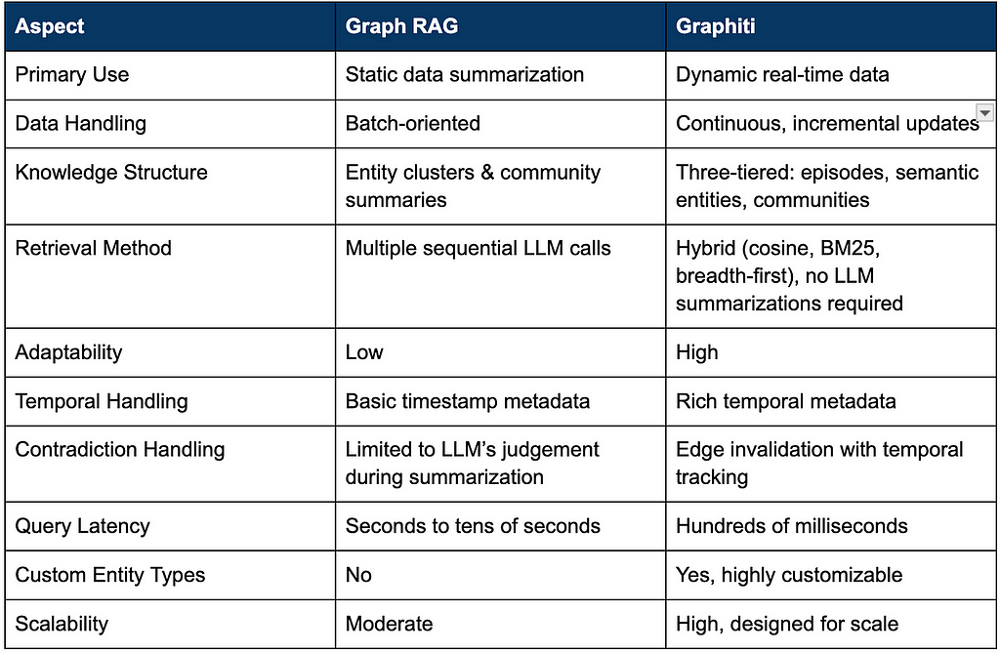

The real potential of AI goes beyond basic chatbots powered by [retrieval-augmented generation](https://neo4j.com/blog/genai/what-is-retrieval-augmented-generation-rag/) (RAG). It’s about creating autonomous agents capable of independently solving tasks — from simple interactions to complex workflows. To do this effectively, agents need more than static retrieval; they need a dynamic memory that continuously integrates user interactions, enterprise data, and external knowledge.

Current RAG approaches struggle when data is updated frequently, limiting their effectiveness for agent-based systems. To solve this, Zep AI’s Graphiti framework introduces a flexible, real-time memory layer built on temporally aware [knowledge graphs](https://neo4j.com/whitepapers/developers-guide-how-to-build-knowledge-graph/) and stored in Neo4j.

Let’s break down how Graphiti works and compare it to query-focused summarization (QFS). In particular, we’ll look at the popular Microsoft Research GraphRAG implementation of QFS.

## GraphRAG: Optimized for Static Data

Microsoft’s approach to GraphRAG builds entity-centric knowledge graphs by extracting entities and relationships and grouping them into thematic clusters or “communities.” It relies on LLMs to precompute summaries of these communities. When handling queries, the Microsoft GraphRAG makes multiple LLM calls — first generating partial community-level responses, then combining them into a single comprehensive answer.

[GraphRAG](https://neo4j.com/blog/genai/what-is-graphrag/) excels at providing detailed, context-rich responses from large static datasets. However, it’s less effective in scenarios where data frequently changes since updates can trigger extensive recomputation of the entire graph. Additionally, its multi-step summarization makes retrieval slow, often taking tens of seconds. This latency and lack of dynamic updates make GraphRAG unsuitable as a comprehensive and holistic memory for agentic applications.

## Graphiti: Real-Time Dynamic Agent Memory

Graphiti helps overcome RAG’s limitations with dynamic data. It’s a real-time, temporally-aware knowledge graph engine that incrementally processes incoming data, instantly updating entities, relationships, and communities without batch recomputation. Graphiti isn’t just another retrieval tool — it’s an ever-present source of context for agents, continuously available and updated.

Graphiti simultaneously handles chat histories, structured JSON data, and unstructured text. All data sources can feed into a single graph, or multiple graphs can coexist within the same Graphiti setup. This gives agents a unified, evolving view of the agent’s world — something traditional RAG systems fundamentally can’t provide.

> Find Graphiti on [GitHub](https://github.com/getzep/graphiti).

## Why Graphiti Works Better With Dynamic Data

Graphiti’s real-time incremental architecture is built for frequent updates. It continuously ingests new data episodes (events or messages), extracting and immediately resolving entities and relationships against existing nodes.

> For an in-depth technical exploration of Graphiti and performance benchmarks, check out [Zep: A Temporal Knowledge Graph Architecture for Agent Memory](https://zep.link/sota-paper).

A key feature is Graphiti’s bi-temporal model, which tracks when an event occurred and when it was ingested. Every graph edge (or relationship) includes explicit validity intervals (t\_valid, t\_invalid). Graphiti uses semantic, keyword, and graph search to determine whether new knowledge conflicts with existing knowledge. When conflicts arise, Graphiti intelligently uses the temporal metadata to update or invalidate, but not discard, outdated information, preserving historical accuracy without large-scale recomputation.

This temporal model enables powerful historical queries, allowing users to reconstruct states of knowledge at precise moments or analyze how data evolves over time.


## Fast Query Speeds: Instant Retrieval Without LLM Calls

Graphiti is built for speed. Zep’s own Graphiti implementation achieves extremely low-latency retrieval, returning results at a P95 latency of 300ms. This is enabled by a hybrid search approach that combines semantic embeddings, keyword (BM25) search, and direct graph traversal — avoiding any LLM calls during retrieval.

The use of vector and BM25 indexes offers near-constant time access to nodes and edges, regardless of graph size. This is made possible by Neo4j’s extensive support for both of these index types.

Graphiti’s query latency makes it ideal for real-time interactions, including voice applications.

## Custom Entity Types: A Simple Ontology Implementation

Graphiti automatically builds an ontology based on incoming data, taking care to de-duplicate nodes and label edge relationships consistently. Beyond automatic ontology creation, Graphiti provides an intuitive method to define custom, domain-specific entities using familiar Pydantic models.

These custom entity types allow precise context extraction, greatly improving the quality of agent interactions. Example entity types might include:

* Personalized user preferences and interests (like favorite restaurants, contacts, hobbies), along with standard attributes (name, birthdate, address)
* Procedural memory, capturing instructions for actions
* Domain-specific business objects (e.g., products, sales orders)

```
from pydantic import BaseModel, Field

class Customer(BaseModel):  
    """A customer of the service"""  
    name: str | None = Field(..., description="The name of the customer")  
    email: str | None = Field(..., description="The email address of the customer")  
    subscription_tier: str | None = Field(..., description="The customer's subscription level")


```

Graphiti automatically matches extracted entities to defined custom types. Custom entity types enhance an agent’s ability to recall knowledge accurately and improve contextual awareness, which is essential for consistent, relevant interactions.

## Key Comparison

The following table shows a breakdown of the key characteristics of Graphiti compared to QFS-based GraphRAG.



## Graph Memory Powering an Agentic Future

Graphiti represents a meaningful departure from traditional RAG methods, specifically because it was built from the ground up as a memory infrastructure for dynamic agentic systems. Graphiti offers incremental, real-time updates through its temporally aware knowledge graph. This design means engineers no longer need to recompute entire graphs when data changes. Instead, Graphiti incrementally integrates updates, resolves conflicts based on temporal metadata, and maintains an accurate historical state.

By removing the bottleneck of LLM-driven summarization at query time, Graphiti achieves practical latency levels that engineers require for interactive real-world applications. Its hybrid indexing system — combining semantic embeddings, keyword search, and graph traversal — allows rapid retrieval in near-constant time, independent of graph scale. With intuitive tools like custom entity types implemented through familiar structures such as Pydantic models, Graphiti addresses a significant capability gap in agent development, equipping engineers with a robust, performant, and genuinely dynamic memory layer.

> Learn more about [Zep and Graphiti](https://www.getzep.com/?utm_campaign=neo4j-graphiti&utm_medium=blog&utm_source=neo4j).


---

[Graphiti: Knowledge Graph Memory for a Post-RAG Agentic World](https://medium.com/neo4j/graphiti-knowledge-graph-memory-for-a-post-rag-agentic-world-0fd2366ba27d) was originally published in [Neo4j Developer Blog](https://medium.com/neo4j) on Medium, where people are continuing the conversation by highlighting and responding to this story.

## The Developer’s Guide: How to Build a Knowledge Graph

This ebook gives you a step-by-step walkthrough on building your first knowledge graph.