> *By 2028, 33% of enterprise software applications will include agentic AI, up from less than 1% in 2024, enabling 15% of day-to-day work decisions to be made autonomously.   
> — Gartner Inc.*

In the evolving AI landscape, [retrieval-augmented generation](https://neo4j.com/blog/genai/what-is-retrieval-augmented-generation-rag/) (RAG) has become the go-to method for grounding large language models (LLMs) with external data. Yet, traditional RAG often relies on unstructured, document-centric methods that lack deep relationship awareness. Enter [GraphRAG](https://neo4j.com/blog/genai/what-is-graphrag/)— an emerging approach that employs the graph-based representation of data to provide richer context, dynamic queries, and more reliable answers.

In this post, we’ll explore:

1. What GraphRAG is and why it outperforms traditional RAG
2. Agentic architecture and how the industry is leaning into it
3. NeoConverse — A cutting-edge experiment in GraphRAG and agentic LLM design
4. A hands-on example using a companies knowledge graph within NeoConverse
5. Final thoughts on where this technology is headed

## What Is GraphRAG and Why Is It Better Than Traditional RAG?

RAG typically employs unstructured or semi-structured data (like documents) by breaking them into smaller, manageable chunks — such as paragraphs or sentences — and generating text embeddings (numerical representations of text) for each chunk using text embedding models. These embeddings are then indexed and searched during query processing to retrieve the most relevant chunks based on keyword similarity or semantic matching, providing external context to LLMs. While this approach is effective for general question answering, it often struggles with:

* Deep relationship queries — Traditional RAG excels at pulling relevant chunks of text based on keyword similarity or semantic closeness but isn’t well-suited for queries that require reasoning over relationships or connections between chunks, documents, entities, or the broader context.
* Fragmented context — Documents are treated as isolated chunks, with embeddings capturing local meaning rather than global coherence, making it challenging to piece together multi-hop reasoning (e.g., “Which suppliers are linked to Company X’s product line, and how have sales trended?”).

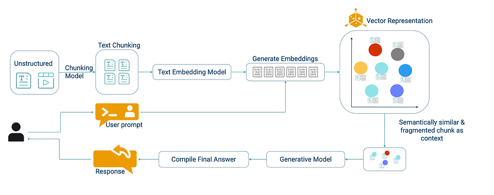

Traditional RAG architecture

Conversely, GraphRAG leverages [knowledge graphs](https://neo4j.com/whitepapers/developers-guide-how-to-build-knowledge-graph/), where entities and relationships are first-class citizens. This approach enables:

1. Contextual retrieval: You can explore the graph structure to find the nodes (companies, suppliers, products) and relationships needed exactly.
2. Rich, multi-hop queries: Graph databases naturally handle multi-level relationships, making it easier to form advanced queries.
3. Explainable reasoning: Graph-based retrieval allows for precise tracking of how an answer is derived by linking it to specific source information, enhancing trust and enabling better auditability.

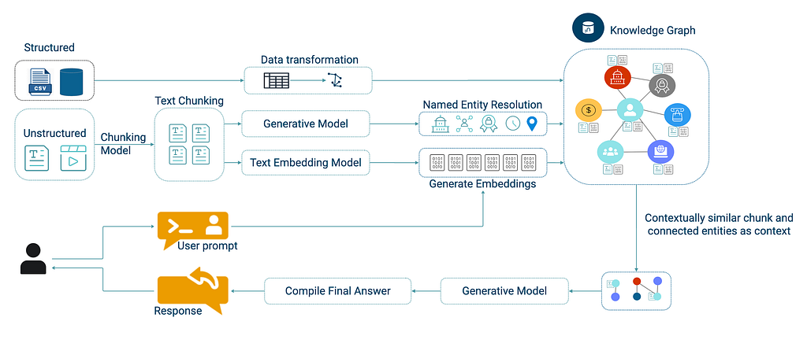

GraphRAG architecture

## What Is Agentic Architecture, and Why Is Industry Turning to It?

Traditional LLM applications rely on monolithic prompt engineering to handle all tasks, whereas agentic architectures use function calling and tool usage to delegate work to specialized components (i.e., agents or tools). A tool is a specific function or API (e.g., database search or calculator), while agents frequently rely on tools to achieve their objectives, acting as orchestrators or decision-makers that invoke and coordinate one or more tools based on the task at hand. For instance:

* Specialized agents: Each agent handles a higher-level task. Agents can use one or many tools, which are the individual integrations with data sources or APIs that perform a retrieval or action task.
* Adaptive LLM: The LLM interprets user intent and selects the best agent or tool rather than depending on predefined rules.
* Scalability and modularity: Additional agents can be easily added or updated without retraining a model.

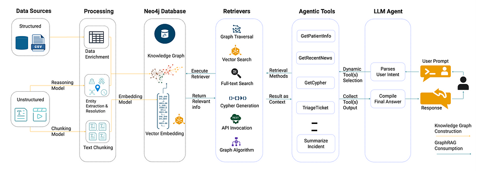

Agentic GraphRAG architecture

## Agentic Architectures

The types of agentic architectures include:

* Single-agent systems: An LLM directly uses tools via function calling, as seen in OpenAI’s early integrations like ChatGPT plugins.
* Multi-agent systems: Multiple agents collaborate, each with a specific role, such as in frameworks like [LangGraph](https://github.com/langchain-ai/langgraph) or [CrewAI](https://github.com/joaomdmoura/crewAI). For instance, one agent retrieves data while another analyzes it.
* Orchestrated frameworks: A central LLM or controller oversees a network of agents, such as in [OpenAI Swarm](https://github.com/openai/swarm), [Amazon Bedrock Agents](https://aws.amazon.com/bedrock/agents/), or [Vextex AI Agent Builder](https://cloud.google.com/products/agent-builder), enabling dynamic task coordination.

### Industry Adoption of Agentic Frameworks

Industry leaders are adopting agentic frameworks for:

* Improved accuracy: Domain experts can fine-tune individual agents without affecting the entire system, ensuring accuracy in specific tasks. Additionally, dedicated agents can act as quality control checkpoints, reviewing outputs for accuracy and consistency. This layered approach minimizes errors while keeping the system flexible.
* Complex workflows: Certain queries require chaining multiple tools — like vector search followed by graph traversal — where agents collaborate and communicate. Specialized agents can augment results with external sources. Guardrail agents can also enforce ethical or operational boundaries, ensuring that the workflow stays on track and aligns with predefined standards.
* Future readiness: As new AI services or knowledge sources become available, they can seamlessly integrate as agents.

## Introducing NeoConverse

[NeoConverse](https://neoconverse.graphapp.io/) is an experimental GenAI application that brings together GraphRAG and agentic architecture in a single environment. Think of NeoConverse as a testbed to see how next-gen LLM solutions could look. Note that it’s *not* a production-ready platform (missing features like SSO or enterprise-grade encryption, sophisticated guardrails, and validations).

NeoConverse is publicly hosted and available for customers to play around with by plugging in their own Neo4j graph database.

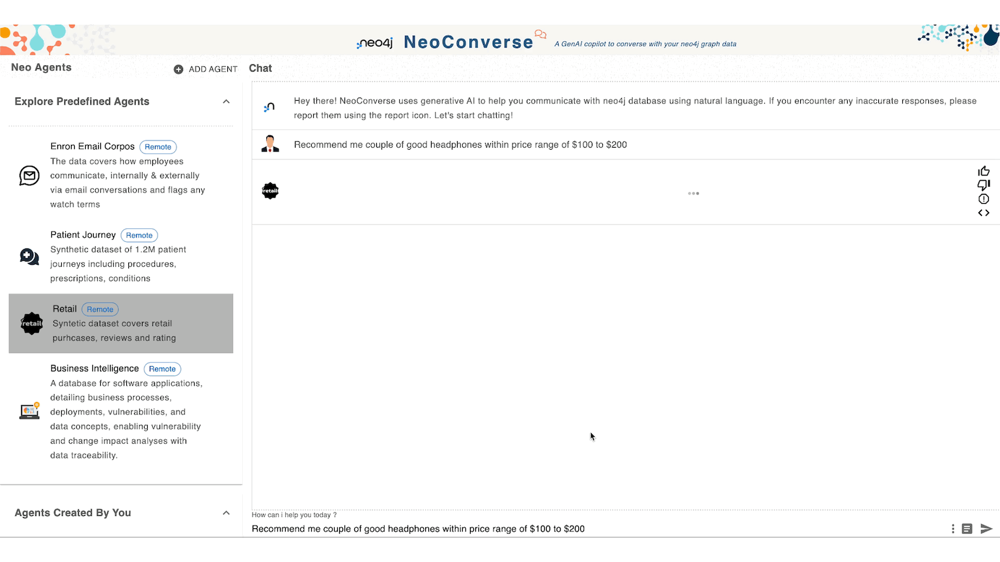

NeoConverse screenshot

### Quick Overview

* **Graph-based intelligence** — Leverages Neo4j to explore rich relationships, execute multi-hop queries, and apply advanced graph algorithms for deeper insights.
* **Agentic tools** — Define specialized tools for diverse domain-specific tasks, using methods including:  
  . Graph traversal  
  . Full-text search  
  . Vector embeddings  
  . Graph data science algorithms  
  . External API integrations
* **Architecture**— NeoConverse uses a single-agent architecture, where the LLM acts as the agent to pick relevant tools on the fly.
* **Automated schema extraction** — Automatically retrieves and updates the Neo4j schema, enabling the LLM to precisely understand available nodes, relationships, and properties.
* **Few-shot context** — Enhance LLM accuracy by supplying example queries and short domain-specific question-answer pairs to better guide understanding.
* **Autonomous tool selection** — Uses function calling to autonomously select the optimal agent or tool, significantly reducing user intervention.
* **Intelligent fallback mechanism** — Defaults gracefully to Text2Cypher query generation when no suitable agentic tool is identified.
* **Dynamic chart generation** — Generates visualizations directly from natural language queries (e.g., “Show a bar chart of revenue by company sector”).
* **Experimental graph visualization** — Visualize query results interactively using the [Neo4j Visualization Library](https://neo4j.com/docs/nvl/current/) for experimental graph visualizations.

### High-Level Architecture

Here’s how NeoConverse works:

1. The user asks a question in plain English.
2. The LLM parses the intent and checks if any user-defined agents apply.
3. If a specialized agent is available, NeoConverse executes the corresponding tool. Otherwise, it falls back to a GetCypher tool for Text2Cypher generation.
4. The retrieved context is sent back to the LLM, which compiles the final answer.
5. NeoConverse returns a grounded, data-backed response to the user.

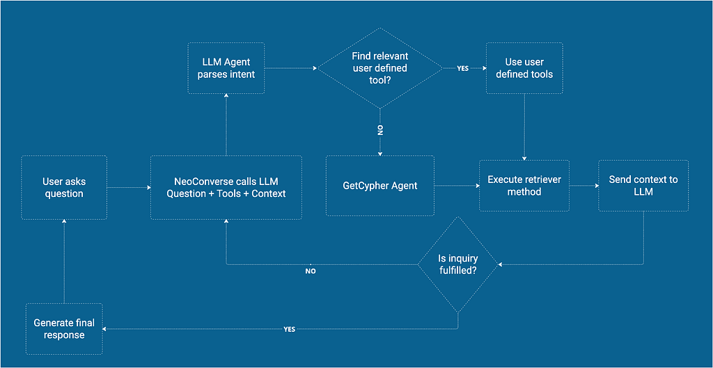

NeoConverse high-level workflow

### Explore NeoConverse With a Companies Dataset

Let’s see NeoConverse in action using a companies knowledge graph built on the Neo4j graph database. The database is hosted as part of the Neo4j Labs sample Neo4j database.

**Database URL**: <https://demo.neo4jlabs.com:7473/browser/>

**Username/Password/Database**: companies/companies/companies

This graph models various organizations, including:

* Companies — With properties like name, sector, founded date
* Locations — Cities, countries
* Executives — CEO, board member relationships to specific companies
* Investments, suppliers, competitors, subsidiaries — From one company to another
* News articles about organizations
* Vectorized chunks of article contents

### Overview of the Data Model

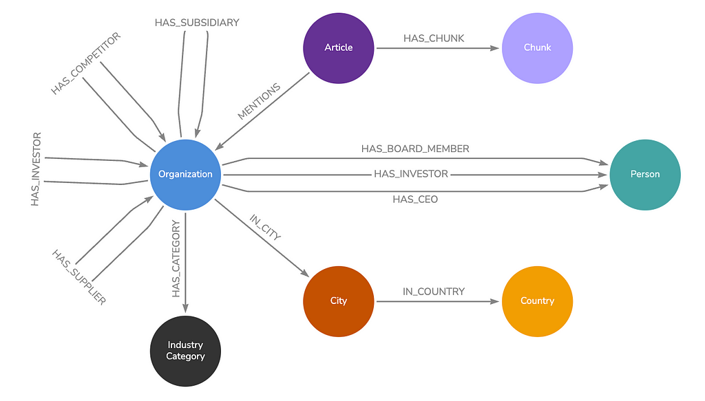

### NeoConverse Agent Setup

Within NeoConverse, you can create a custom agent from the menu on the left side. The agent configuration gathers the following information.

**1. General**: Provide a name and description of the agent.

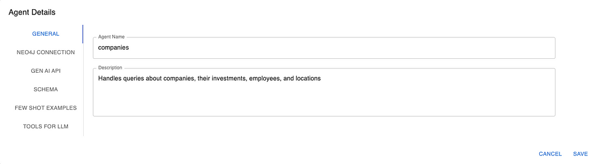

General Agent Details screenshot

**2. Neo4j Connection**: Configure Neo4j connection detail to converse with.

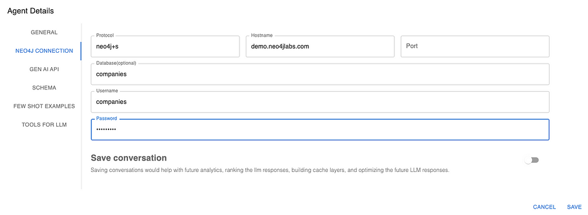

Neo4j connection screenshot

**3. GenAI API:** Set API credentials and LLM model config.

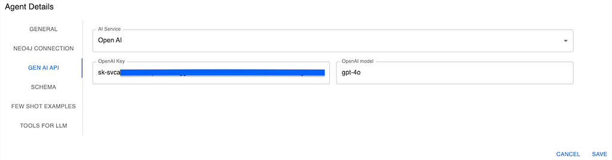

GenAI API screenshot

**4. Schema:** Automatically extracts the schema based on Neo4j connection details.

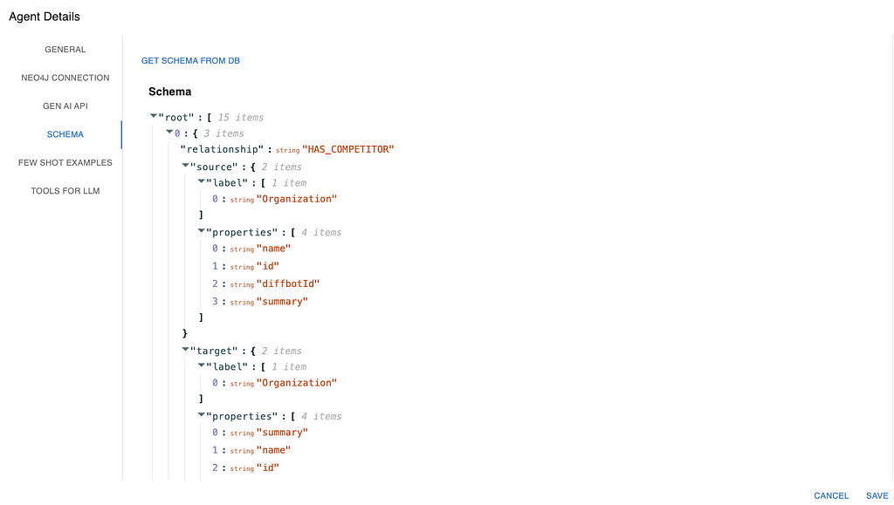

Schema screenshot

**5. Few-Shot Examples:** In-context learning samples.

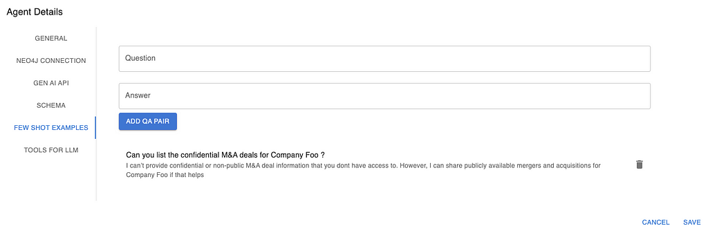

Few-Shot Examples screenshot

**6. Tools for LLM:** Create tools with goals and retrieval methods.

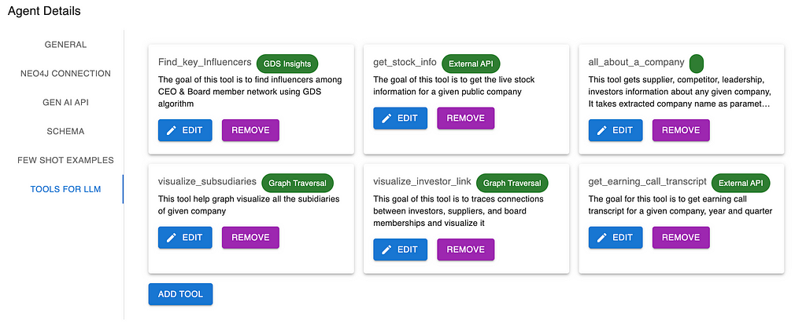

Tools for LLM screenshot

NeoConverse provides various tools for knowledge discovery, including:

1. **Neo4j graph traversal query** — For complex queries involving connected data across the graph (e.g., “Find all employees who joined Company X in 2020”).
2. **Neo4j full-text search** — Supports fuzzy searching for approximate matches in the graph (e.g., “Search companies with ‘machine learning’ in their description”).
3. **Neo4j Graph Data Science** — Unlocks insights and patterns through graph algorithms (e.g., “Run community detection to find clusters of companies by sector”).
4. **Neo4j vector search** — Allows document and semantic search based on vector embeddings (e.g., “How are companies reacting to recent economic conditions?”).
5. **External API call**—Invoke an external API to retrieve context.
6. **Fallback mechanism** — If no relevant tool is identified, NeoConverse uses Text2Cypher as a fallback, generating the appropriate Cypher query to interact with Neo4j.

Your agent will dynamically choose which retrieval to invoke based on user queries.

## Demonstrating GraphRAG vs. Traditional RAG: A NeoConverse Experiment

Get ready for an exciting look at how GraphRAG outperforms traditional RAG! In this experiment, we compare the two retrieval approaches to see which can deliver more accurate results — especially when entity relationships *really* matter.

### Traditional RAG

We set up a single LLM tool for traditional RAG, which depends entirely on vector similarity search to identify relevant contexts. Next, we compare it to GraphRAG, an enhanced approach that combines a knowledge graph with vector similarity for improved performance. The tool config for traditional RAG is shown below.

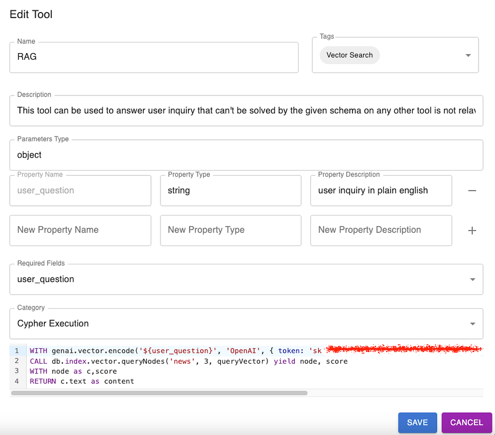

Traditional RAG tool config screenshot

The Cypher query used in this RAG tool performs a semantic search on a Neo4j vector index (news) to find the most relevant news articles based on a user’s question:

1. Encode the user’s question into an embedding vector using OpenAI’s text-embedding-ada-002 model.
2. Query the news vector index, retrieving the top three most similar articles.
3. Return the matching news content sorted by relevance.

Experiment question: “Give a brief summary of the customers of Palantir.”

The answer the LLM comes back with:

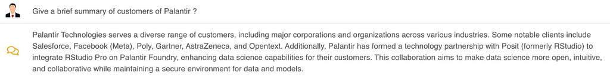

The LLM confidently listed several companies (including Salesforce, Facebook, and Gartner) as Palantir customers, but guess what? They aren’t Palantir customers at all! Independent searches confirmed this discrepancy.

Let’s take a deeper look at why RAG failed by breaking down the results from the RAG retriever query. The following screenshot shows the retrieved LLM context using the traditional RAG retriever.

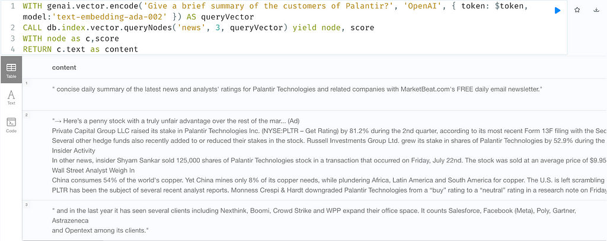

Misleading semantic similarity:

* The first two retrieved documents were about Palantir but did not contain any customer information for Palantir — just some stock-related information.
* The third retrieved document was about customers of a different company (WeWork), but because it contained customer-related phrases, it was deemed similar. The LLM mistakenly used this document as the basis for its final answer.

Lack of contextual awareness:

* The vector search algorithm doesn’t understand relationships between entities. It simply retrieves text snippets with high semantic similarity, even if they are contextually incorrect.
* Since there was no knowledge graph to verify entity relationships, the LLM had no way to differentiate WeWork’s customers from Palantir’s.

### GraphRAG

To improve accuracy, we modified the retrieval query to use GraphRAG instead of traditional RAG:

```
CALL db.index.fulltext.queryNodes('entity', 'Palantir', {limit:1}) YIELD node AS org  
OPTIONAL MATCH (org)-[:HAS_INVESTOR]->(investor)  
OPTIONAL MATCH (org)<-[:HAS_INVESTOR]-(investing)  
OPTIONAL MATCH (org)-[:HAS_COMPETITOR]-(competitor)  
OPTIONAL MATCH (org)-[:HAS_SUPPLIER]->(supplier)  
OPTIONAL MATCH (org)<-[:HAS_SUPPLIER]-(supplies)  
OPTIONAL MATCH (org)-[:HAS_BOARD_MEMBER]->(board)  
OPTIONAL MATCH (org)-[:HAS_CEO]->(ceo)  
WITH org.name AS organization,  
    COLLECT(DISTINCT investor.name) AS investors,   
    COLLECT(DISTINCT investing.name) AS investingIn,  
    COLLECT(DISTINCT supplier.name) AS hasSupplier,   
    COLLECT(DISTINCT supplies.name) AS suppliesTo,  
    COLLECT(DISTINCT board.name) AS board_members,   
    COLLECT(DISTINCT ceo.name) AS ceo,  
    COLLECT(DISTINCT competitor.name) AS competitors  
CALL (){  
    WITH genai.vector.encode('${user_question}', 'OpenAI',   
    { token: $token, model:'text-embedding-ada-002' }) AS queryVector  
    CALL db.index.vector.queryNodes('news', 3, queryVector)   
    yield node as c, score  
    MATCH (c)<-[r:HAS_CHUNK]-(article:Article)-[:MENTIONS]-(o:Organization)  
    WITH o.name as company, COLLECT(c.text) as newsContent  
    RETURN COLLECT({company:company, newsContent:newsContent}) as optionalContextUseItIfRelevant  
}  
RETURN organization, investors, investingIn, competitors,    
hasSupplier, suppliesTo, board_members, ceo, optionalContextUseItIfRelevant
```

This Cypher query retrieves key relationships for Palantir while also performing a semantic news search to provide additional context.

* Find Palantir using a full-text search, so the user doesn’t need to provide the exact company name in the prompt.
* Match all incoming and outgoing relationships to get a 360-degree view of the organization (HAS\_INVESTOR, HAS\_COMPETITOR, HAS\_SUPPLIER, HAS\_BOARD\_MEMBER, HAS\_CEO).
* Augment it with additional context from vector search.
* Return all extracted insights, along with optional news context, to enhance responses.

The context provided to LLM is shown below.

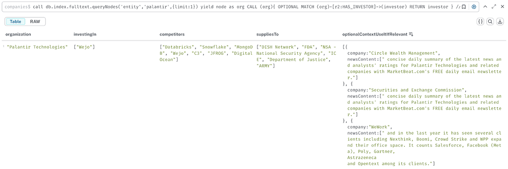

The final answer:

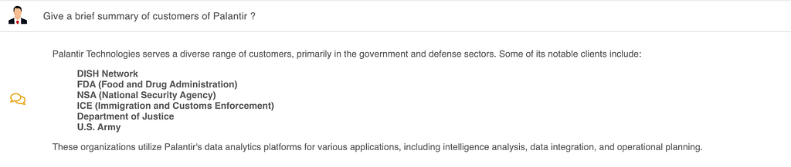

With GraphRAG, the LLM now correctly identified Palantir’s actual customers while excluding unrelated entities like Salesforce and Facebook.

Why? Because GraphRAG ensured that retrieved articles were anchored to Palantir’s node in the knowledge graph, providing better context for the LLM to generate an answer.

### Key Takeaways


Key takeaways from traditional RAG vs. GraphRAG

For simple text retrieval and summarization tasks, Traditional RAG may still be useful, but it should be combined with graph-based retrieval when entity relationships matter.

## Agentic Architecture in Action: A NeoConverse Demonstration

So far, we’ve explored how GraphRAG leverages the connections within your knowledge graph for RAG. Let’s now examine how agentic architecture takes these AI-powered workflows to the next level.

In a world buzzing with new AI applications every day, the question is no longer *whether* AI can solve a problem — it’s how effectively it can navigate complexity, orchestrate resources, and deliver results. That’s exactly where agentic architecture comes in.

Imagine a team of skilled specialists in different areas, each ready to jump in at precisely the right moment. Now replace that “team” with a single AI system, one that can pivot between tools, gather and interpret data, and respond with a smooth and insightful answer. That’s the agentic framework.

### The Demonstration

In our companies knowledge graph data model, we’ve captured the complex relationships between companies, their investors, suppliers, and subsidiaries. However, to truly showcase the potential of agentic architecture, we wanted to go further. We aimed to equip NeoConverse with the ability to fetch real-time stock information — a dataset that wasn’t natively present in our current graph.

To achieve this, we created a tool within NeoConverse. Again, think of a tool as a specialized function that the AI can call upon to perform a specific task. In this case, our tool, named “get\_stock\_info,” retrieves live stock data for a given company ticker using an external API.

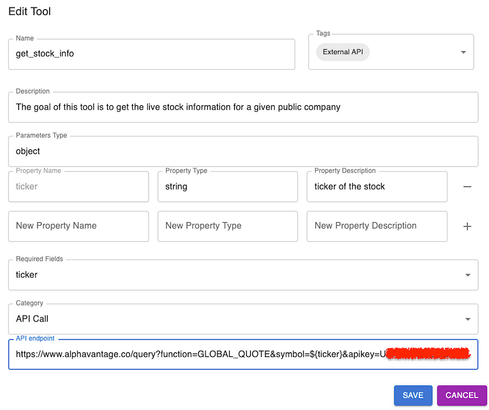

#### Steps

Now get ready to see how an agentic framework orchestrates your AI-driven workflows! Here’s a step-by-step walkthrough of how this approach works in practice:

**1. Receive the request**

A user poses a complex question:

“*Identify the company with the most media coverage, provide a summary of any insights you may have, and its current stock price.*”

The agentic framework perks up immediately, parsing the question and assessing which tools it needs to generate a full answer.

**2. Mobilize the tools**

The AI recognizes it needs three pieces of information:  
– Which company leads in media attention  
– Insights about that company  
– That company’s latest stock price

**Tool selection:**The AI first calls a database query tool (e.g., get\_cypher) to retrieve the company with the highest media mentions.

Next, it selects an all-about-a-company and stock information tool (e.g., all\_about\_a\_company and get\_stock\_info) to fetch insights about the resulting company and its current price.

Instead of blindly trying a single resource, the agentic framework dynamically picks the right tools at the right time like a skilled problem-solver.

**3. Orchestrate data retrieval**

**Database query execution:**The framework’s orchestrator sends the generated query to the database and returns the result: “Accenture” has the most mentions.

**Company insights:**The orchestrator hands the company name “Accenture” to the company insights tool, retrieving all information about the company.

**Stock price lookup:**In parallel, the orchestrator hands Accenture’s ticker (“ACN”) to the stock tool, retrieving up-to-date market data.

The system seamlessly coordinates multiple agents without skipping a beat. It intelligently figures out the order of which tool to use when and when to execute sequentially vs. parallel. Each response flows back into the AI to refine the final answer.

**4. Deliver the answer**

Once the LLM has all the information to answer the user’s question, the AI composes a concise, user-friendly reply.

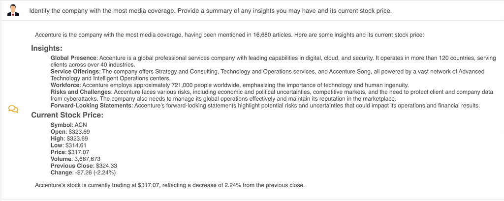

All of this happens behind the scenes. As a user, you simply read the final answer, which blends the output of multiple specialized processes the AI orchestrated.

### Key Takeaways

* **Adaptive problem-solving:** The framework actively chooses which tools to use based on context.
* **Seamless information flow:** It pulls data from multiple sources — no manual interventions are needed.
* **Smart orchestration:** Each tool is invoked in the proper sequence, ensuring a smooth end-to-end solution.
* **Human-like reasoning:** Natural language understanding helps it interpret nuanced questions.
* **Action-taking**: Once the right tools are identified and tasks are completed, it initiates follow-up actions or tasks based on its findings, providing true end-to-end automation.
* **Effortless scalability:** Adding new tools boosts the system’s capabilities.

In essence, an agentic framework turns your AI into a resourceful multitasker — one that figures out exactly what it needs to do, then does it, all while keeping the user experience front and center. It’s like having a personal team of specialists ready to jump in and tackle the challenge at hand!

## Closing Thoughts

By combining GraphRAG’s ability to tap into graph-based knowledge with the agentic architecture approach in NeoConverse, we unlock AI workflows that are not only powerful but also highly adaptable. GraphRAG ensures that relevant, relationship-centric data is surfaced at the right time, while the agentic framework orchestrates each step — whether querying a graph database, fetching insights, or calling external APIs. Together, these tools form a flexible system that’s easier to maintain, infinitely scalable, and more intelligent than traditional monolithic solutions.

NeoConverse is fully open-source, and you’re invited to explore it for inspiration, adaptation, or use in your own projects. Check out the [GitHub repository](https://github.com/neo4j-labs/neoconverse) for the source code. Whether you’re building a next-generation recommendation engine or automating data-intensive research, the synergy of Neo4j and GenAI sets the stage for richer, more context-aware applications. Ultimately, it’s about creating AI-driven experiences that feel seamless and efficient — delivering the answers you need by leveraging the best of both graph and agentic thinking.

To learn more, check out [NeoConverse](https://neo4j.com/labs/genai-ecosystem/neoconverse/) on Neo4j Labs.


---

[A Practical Experimentation of GraphRAG and Agentic Architecture With NeoConverse](https://medium.com/neo4j/a-practical-experimentation-of-graphrag-and-agentic-architecture-with-neoconverse-55c463ff1a3c) was originally published in [Neo4j Developer Blog](https://medium.com/neo4j) on Medium, where people are continuing the conversation by highlighting and responding to this story.

## The Developer’s Guide: How to Build a Knowledge Graph

This ebook gives you a step-by-step walkthrough on building your first knowledge graph.