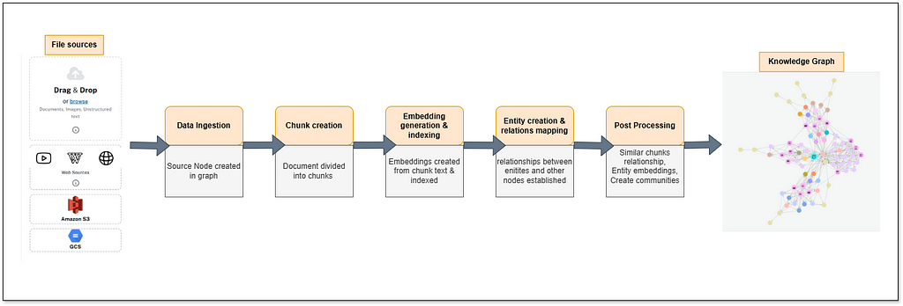
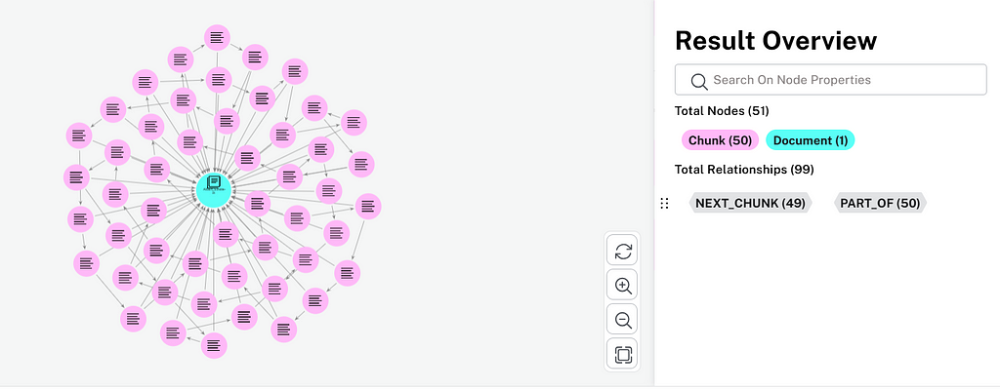
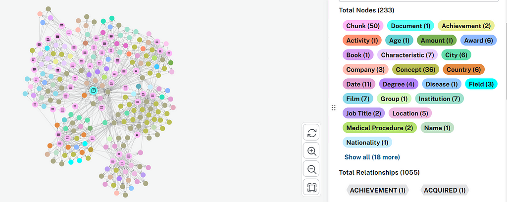
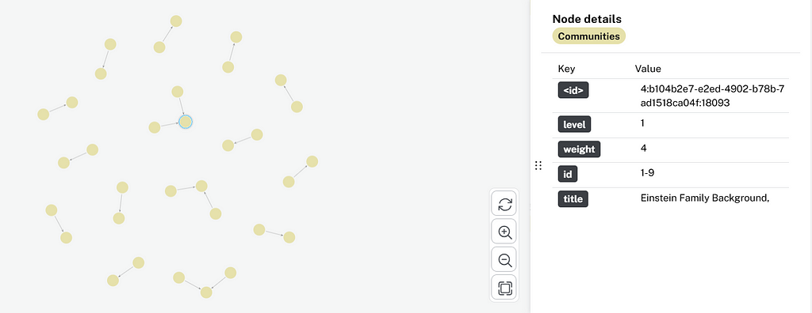

Unstructured data, such as PDFs, emails, and web content, contains valuable insights, but extracting structured knowledge from it remains a challenge. Transforming this scattered information into an organized, queryable format requires a robust system that efficiently handles diverse data sources.

In this blog post, we explore how the extraction process works, covering:

* Ingestion of unstructured data from various sources (PDFs, Amazon Simple Storage Service (S3), Google Cloud Storage, URLs, transcripts)
* Chunking strategies to break down large documents for efficient processing
* Embedding generation to enable semantic search using Neo4j’s vector index
* Entity extraction using LLMs and graph transformation techniques
* Post-processing techniques to refine and optimize the [knowledge graph](https://neo4j.com/whitepapers/developers-guide-how-to-build-knowledge-graph/)

**This post is part of our ongoing series covering various aspects of the** [**Neo4j LLM Knowledge Graph Builder**](https://llm-graph-builder.neo4jlabs.com/)**:**

1. [Overall functionality](https://neo4j.com/blog/developer/llm-knowledge-graph-builder/)
2. Architecture
3. Knowledge graph extraction
4. Graph visualization
5. GraphRAG retrievers

By the end of this article, you’ll gain a deeper understanding of how automated text processing and graph-based structuring work together to enable seamless knowledge discovery.

## Understanding the Extraction Process

The extraction pipeline of the Neo4j LLM Graph Builder follows a structured approach, ensuring that unstructured data systematically processes and transforms into a queryable knowledge graph. It consists of multiple steps: data ingestion, chunking, embedding generation, entity extraction, and post-processing. Each plays a critical role in building a semantically rich graph representation.

The following flow diagram provides an overview of this step-by-step transformation from raw text to a structured knowledge graph.

*Flow diagram for extraction process*

### Step 1: Data Ingestion

This system processes unstructured data from various sources — local files, PDFs stored in Amazon S3, Google Cloud Storage buckets, web URLs, YouTube transcripts, and Wikipedia links. The user selects the data source, and they’re read via various document loaders.

Local files uploaded from Google Cloud Storage or s3 buckets:

* PDF documents load through the [PyMuPDF](https://pymupdf.readthedocs.io/en/latest/)library.
* Other documents (.txt, docs, .ppt are read through [LangChain’s (unstructured.io) document loaders](https://python.langchain.com/docs/integrations/document_loaders/unstructured_file/).
* Wikipedia articles load through [LangChain’s Wikipedia loader](https://python.langchain.com/docs/integrations/document_loaders/wikipedia/).
* Web URLs load through [LangChain’s WebBaseLoader](https://python.langchain.com/docs/integrations/document_loaders/web_base/).
* YouTube videos are extracted for their transcripts using the [YouTube Transcript API](https://pypi.org/project/youtube-transcript-api/).

Each document is represented as a source node in the Neo4j database. Metadata such as file name, type, source URL, and size are stored as node properties. This ensures traceability and allows the application to efficiently manage different data sources.

### Step 2: Chunk Creation

To handle large documents effectively, the system splits them into smaller, manageable chunks using a token-based splitter. Configurable constants like CHUNKS\_TO\_BE\_CREATED and chunk\_size define the size and number of chunks. These parameters can be provided from the UI in the graph enhancement section.

The chunk-size restriction is undoubtedly crucial because the vector embedding of each chunk should capture the essence of its meaning, and chunks that are too large get too broad and vague. Chunking ensures that the retrieved data fits within the LLM’s input window, enabling efficient and accurate processing.

Graph showing document source node and chunks created, along with relationships

Each chunk is represented as a chunk node in Neo4j with properties like document position, and offset and length of text.

Relationships are established between chunks and their parent document:

* PART\_OF**:** Links each chunk to the parent document
* NEXT\_CHUNK**:** Establishes sequential relationships between chunks

### Step 3: Embedding Generation

The chunked data transforms into a vector representation using embedding models.

If embeddings are enabled (IS\_EMBEDDING = True), each chunk’s text is embedded using a configurable embedding model. By default, this uses the SentenceTransformer embedding model, which generates 384-dimensional vectors for each chunk. Other notable embedding models configured are OpenAI, Vertex AI, and Titan AI.

These embeddings store as a property of the chunk node and enable similarity searches through Neo4j’s vector index.

A vector index named “vector” is created for chunk nodes, making it possible to retrieve semantically similar chunks during queries. These vectors capture the semantic meaning of each chunk. This built-in Neo4j vector index (“vector”) allows for efficient similarity searches (using the Hierarchical Navigable Small Worlds (HNSW)) — finding chunks most relevant to a given user question or query.

This step bridges unstructured text and machine learning by providing a numerical text representation.

After chunk creation, entities are extracted from chunk text using LLMs and Neo4j’s LLMGraphTransformer.

This platform provides a selection of pretrained LLMs, including popular options such as OpenAI’s GPT-4 (GPT-4o and GPT-4o mini) and Google Gemini 1.5 and 2.0, as well as specialized models like Diffbot. Other models are available in development mode or for self-deployment. These models are optimized for different tasks, languages, and data types, allowing users to choose the most suitable model for their specific dataset and needs.

#### LLMGraphTransformer

This process leverages the [LLMGraphTransformer](https://python.langchain.com/v0.1/docs/use_cases/graph/constructing/#llm-graph-transformer) library from LangChain. Specifically, the *convert\_to\_graph\_documents* method within this library transforms the chunk data into a structured representation called *GraphDocument*. A GraphDocument is essentially a graph data structure consisting of a list of nodes (representing entities) and their relationships (edges connecting the nodes). This graph representation allows for a more nuanced and contextual understanding of the extracted entities and their connections within the original data.

The LLMGraphTransformer correspondingly enables the creation of knowledge graphs with a focus on nodes, relationships, and their properties — all while adhering to the following configurable constraints:

* Users can specify which node types (allowed\_nodes) and relationship types (allowed\_relationships) to include in the graph. This ensures that only relevant elements extract, reducing noise and focusing on the desired graph structure.
* Rich property extraction — The transformer supports extracting custom properties for nodes and relationships. Users can allow unrestricted property extraction or define specific properties to include, enhancing the granularity of the resulting graph.
* Additional instructions — Users can provide additional instructions in the graph enhancement section to pass on to the LLMGraphTransformer to focus on particular topics (e.g., focus on healthcare terms or ignore technical jargon, etc.). This helps to extract entities in line with requirements.

Each extracted entity is represented as an entity node in the graph and links to the originating chunk through a HAS\_ENTITY relationship.

Graph showcasing entities created along with relationships between entities

The system allows further refinement by merging related/duplicate entities in the graph enhancement section.

The application’s entity extraction process combines smaller text embedding chunks into larger text fragments. A configurable parameter (NUMBER\_OF\_CHUNKS\_TO\_COMBINE) controls the size of these fragments, currently kept as 1. Consequently, if this value increases, that many chunks will group together before processing.

### Step 5: Post-Processing and Knowledge Graph Optimization

Post-processing is a crucial phase in the knowledge graph creation pipeline, refining the graph structure, enabling advanced search functionalities, and integrating community detection for enhanced insights. The post-processing API integrates various tasks, ensuring that the knowledge graph is enriched, optimized, and ready for downstream applications.

### Processing

Processing includes the following tasks. You can enable or disable them in the graph enhancement section:

1. **Updating text chunk similarities**  
   This step utilizes a k-nearest neighbor (KNN) algorithm to update graph similarities between chunks. By analyzing embedding-based distances, the graph captures stronger connections between similar content.
2. **Hybrid and full-text search enablement**  
   Hybrid search combines vector-based similarity with full-text search capabilities. This step creates vector and full-text indexes, enabling efficient search queries in tools like Neo4j Bloom. Users can perform semantic and keyword searches seamlessly.
3. **Entity embeddings**  
   Entities in the graph embed using a language model, allowing for similarity calculations between entities. This enables tasks like clustering and entity disambiguation. However, entity embeddings create only if the ENTITY\_EMBEDDING flag is enabled.
4. **Graph schema consolidation**  
   The graph schema consolidation step standardizes node labels and relationships to maintain a clean and logical structure. Using a language model, redundant or inconsistent labels and relationships are unified, ensuring clarity and consistency in the graph’s schema. Users can enable this option through the graph enhancement tab.
5. **Community detection**  
   Users can enable the communities option in the graph enhancement section. Communities represent areas where nodes are more tightly interconnected with one another than with nodes in other groups. Communities are formed using algorithms like Leiden clustering. Community notes are created in the knowledge graph to represent clusters of related entities or chunks. Relationships such as IN\_COMMUNITY and PARENT\_COMMUNITY link nodes to their communities and parent-child relationships between communities. Communities have a hierarchy from 0 to 2 — 0 being the base community, 1 being a parent community connecting to base communities, and 2 being a parent community to first-level parent communities.
6. **Community summaries**  
   Summaries generate for each community using LLMs to provide a concise overview of its content. Properties like summary and title are added to community nodes. Summaries enable broader questions like summarization or multi-context questions to be answered effectively. Community titles generate through an LLM to give concise titles to summaries, enabling proper identification of community nodes.

Graph showcasing community nodes

## Key Challenges Addressed by the Neo4j LLM Knowledge Graph Builder

### Bridging the gap Between Unstructured Text and Structured Graph Data

* Challenge: Traditional methods of creating knowledge graphs from text are often manual, time-consuming, and require significant domain expertise. Extracting entities and relationships accurately and consistently from unstructured text is complex.
* Solution: The Neo4j LLM Knowledge Graph Builder leverages the power of LLMs to automate the process of extracting knowledge from text and transforming it into a graph structure within Neo4j. LLMs, with their advanced natural language understanding capabilities, can identify entities, relationships, and nuances within text, significantly simplifying the graph-building process.

### Eliminating the Need for Complex Schema Design and Mapping

* Challenge: Defining a graph schema (node labels, relationship types, properties) beforehand can be a bottleneck. It requires anticipating all possible entities and relationships, which is difficult when dealing with diverse and evolving datasets. Manually mapping text data to this schema is also tedious.
* Solution: The application uses LLMs to dynamically infer the schema based on the input text. It doesn’t require a rigid, pre-defined schema, making the graph-building process more flexible and adaptable to various data sources and domains. This reduces the initial setup effort and allows for easier evolution of the graph as new information is added.

### Reducing the Dependency on Handcrafted Rules and Patterns

* Challenge: Traditional rule-based or pattern-based approaches for information extraction are brittle and struggle to handle the variability and ambiguity inherent in natural language. Additionally , they require extensive manual effort to create and maintain the rules.
* Solution: By employing LLMs, the application can generalize from learned patterns in the data, reducing the need for explicit rule definition. LLMs can handle different languages, linguistic variations, implicit relationships, and complex sentence structures more effectively, leading to higher accuracy and robustness.

### Simplifying Prompt Engineering for Graph Construction

* Challenge: Interacting with LLMs to perform specific tasks like graph construction requires crafting effective prompts. This can be a non-trivial task, requiring an understanding of prompt engineering principles and experimentation.
* Solution: The Neo4j LLM Knowledge Graph Builder provides a user-friendly interface and potentially pre-built prompt templates (or logic to generate them) designed for graph construction. It abstracts away the complexity of direct prompt engineering, making it easier for users to build graphs without needing to become prompt-engineering experts.
* Furthermore, users can provide additional instructions like, “Do not include scientific jargon. Focus more on healthcare terminology, etc.”

### Enabling Efficient and Scalable Graph Construction

* Challenge: Building large-scale knowledge graphs manually is not feasible. Automating the process and making it efficient is crucial for real-world applications.
* Solution: The application streamlines the graph construction process through automation, allowing users to build large and complex graphs from substantial text much faster than manual methods. The integration with Neo4j, a scalable graph database, ensures efficient storage and querying of the resulting graph.

## Summary

The extraction process in the Neo4j LLM Knowledge Graph Builder transforms raw text into structured knowledge, making it searchable, queryable, and contextually meaningful. Through automated chunking, embedding generation, entity extraction, and post-processing, it enables organizations to efficiently construct knowledge graphs from unstructured data sources.

By leveraging LLMs and Neo4j’s graph database capabilities, this process eliminates the need for manual data structuring, making large-scale knowledge extraction faster and more scalable. With features like configurable chunking, embedding-based similarity searches, and schema consolidation, the system ensures accuracy, flexibility, and adaptability for various domains.

As advancements in LLMs and knowledge graphs continue, tools like the Neo4j LLM Knowledge Graph Builder will play a key role in intelligent data processing, search, and retrieval.

Stay tuned for the next post in this series, where we dive deeper into graph visualization techniques and how extracted knowledge is represented in Neo4j.

We welcome your thoughts and feedback — drop a comment or raise an issue on [GitHub](https://github.com/neo4j-labs/llm-graph-builder) to share your insights!

To learn more, check out [Introduction to the Neo4j LLM Knowledge Graph Builder](https://neo4j.com/blog/developer/llm-knowledge-graph-builder/).

---

[Knowledge Graph Extraction and Challenges](https://medium.com/neo4j/knowledge-graph-extraction-process-challenges-afec3b0886d6) was originally published in [Neo4j Developer Blog](https://medium.com/neo4j) on Medium, where people are continuing the conversation by highlighting and responding to this story.

## The Developer’s Guide: How to Build a Knowledge Graph

This ebook gives you a step-by-step walkthrough on building your first knowledge graph.