***Extract and generate a knowledge graph from educational curriculum information without writing a single line of code***

In today’s data-driven world, [knowledge graphs](https://neo4j.com/whitepapers/developers-guide-how-to-build-knowledge-graph/) have emerged as a powerful way to capture and query complex relationships between different entities.

[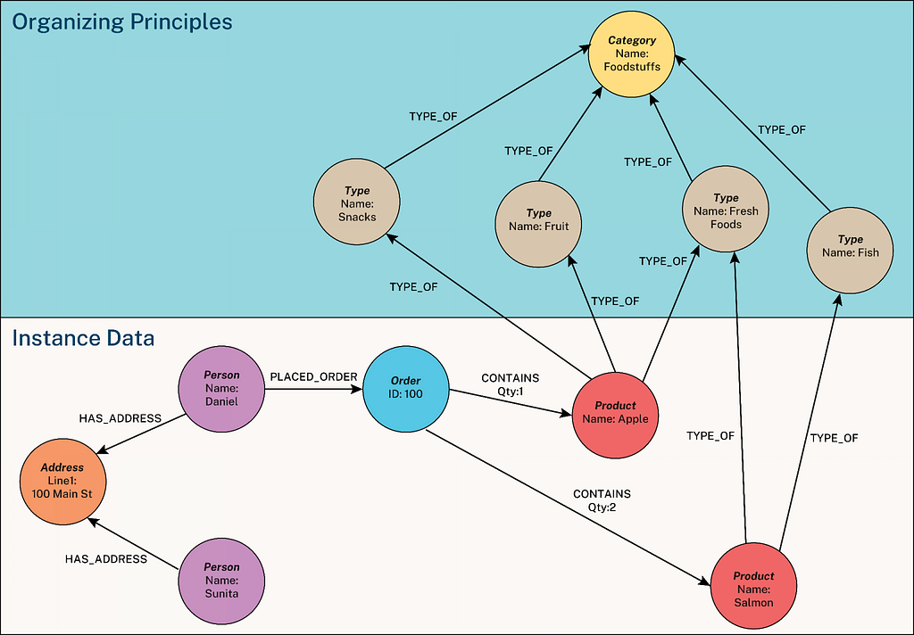](https://neo4j.com/blog/genai/what-is-knowledge-graph/)

An example knowledge graph showing nodes as circles and relationships as arrows; instance data and organizing principles are highlighted for display

While traditionally building knowledge graphs required extensive coding knowledge, the landscape is changing. I recently explored a streamlined approach combining Anthropic’s Claude AI assistant with the [Neo4j graph database](https://neo4j.com/product/neo4j-graph-database) using the [Model Context Protocol](https://modelcontextprotocol.io/introduction)— without writing a single line of code.

This article walks through my experience creating a comprehensive knowledge graph for an educational system — specifically, modeling exam schedules and curricula for a school — completely through conversation with an AI assistant.

## What Is the Model Context Protocol?

The [Model Context Protocol](https://modelcontextprotocol.io/introduction) is an emerging standard that allows AI models to interact with external tools and data sources. It enables AI assistants like Claude to execute commands on systems like databases, providing expanded capabilities beyond their training data. Learn more in the [Model Context Protocol](https://modelcontextprotocol.io/introduction) documentation.

In simpler terms, MCP allows Claude to “see” and interact with your Neo4j database directly. For more information, check out [Claude Converses With Neo4j Via MCP](https://neo4j.com/blog/developer/claude-converses-neo4j-via-mcp/).

## Prerequisites

To follow along with this approach, you’ll need:

1. **Docker Desktop** for running Neo4j in a container
2. **Neo4j database** either as a Docker container or cloud instance
3. **UV package manager** for installing Python dependencies

**MacOS/Linux:**

```
curl -LsSf https://astral.sh/uv/install.sh | sh
```

**Windows:**

```
powershell -ExecutionPolicy ByPass -c "irm https://astral.sh/uv/install.ps1 | iex"
```

**4.** [**Claude for Desktop**](https://www.anthropic.com/claude-desktop)

**5. MCP plugin configuration** for connecting Claude to Neo4j; uses the [mcp-neo4j-cypher](https://github.com/neo4j-contrib/mcp-neo4j/tree/main/servers/mcp-neo4j-cypher) server provided by Neo4j

## Setting Up the MCP Configuration

The key to making this work is properly setting up the MCP configuration. Here’s the configuration I used:

```
"neo4j": {  
    "command": "/Users/<username>/.local/bin/uvx", # **Replace this** with the full path to your 'uv' executable  
    "args": [  
        "mcp-neo4j-cypher",  
        "--db-url",  
        "bolt://localhost",  
        "--username",  
        "neo4j",  
        "--password",  
        "password"  
    ]  
}
```

Get the cloud configuration and MCP plugin [details](https://github.com/neo4j-contrib/mcp-neo4j/tree/main/servers/mcp-neo4j-cypher).

This configuration connects Claude to a locally running Neo4j instance using the Bolt protocol. You need to adjust the path to your uvx executable and the database credentials according to your setup.

## Verifying the Setup

Upon launching Claude for Desktop, you should see new tools from Neo4j:

1. **get-neo4j-schema** for retrieving the schema of your Neo4j database
2. **read-neo4j-cypher** for querying information from your graph database
3. **write-neo4j-cypher** for updating graph data in the database

These tools appear in your Claude for Desktop interface, indicating successful MCP integration with Neo4j.

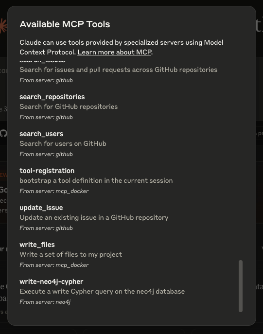

List of my installed MCP tools, including Neo4j

## Case Study: Building an Educational System Knowledge Graph

To demonstrate the power of this approach, I decided to model an educational system — specifically, the exam schedule and curriculum for [Brainiacs Tutoring Centre’s Grade 4B Term 2 exams](https://brainiacstutoring.co.za/product-category/grade4/).

### Step 1: Create the Basic Schema

The first step was to establish the basic structure of our graph database. Through conversation with Claude, I outlined the entities and relationships I wanted to model:

* **School**: Brainiacs Brainiacs Tutoring Centre
* **Grade**: Grade 4, Division B
* **Subjects**: Mathematics, English, Science, etc.
* **Exams**: Scheduled examinations with dates
* **Topics**: Specific curriculum portions for each subject

Instead of writing queries, I simply explained what I wanted to Claude, which then generated and executed the Neo4j Cypher commands to build this structure.

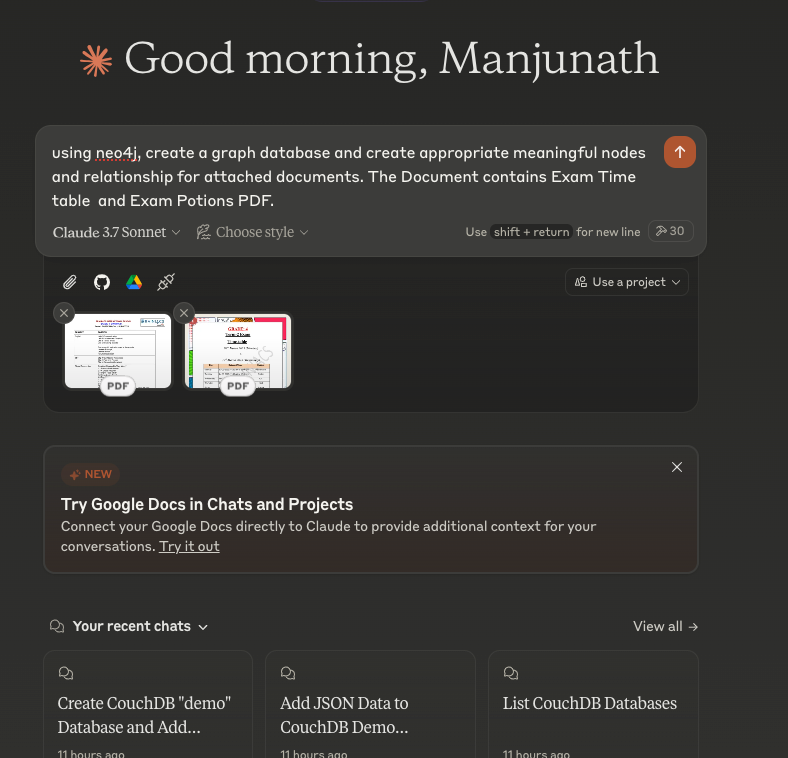

Instructing Claude to generate the schema and analyze documents

### Step 2: Add Entities and Relationships

After establishing the schema, I needed to populate the database with actual data from my school documents. Claude analyzed the exam schedule and curriculum documents I shared, then automatically created:

* School node with proper name
* Grade node with division and term information
* Subject nodes for each course
* Exam nodes with dates, times, and day of the week
* Topic nodes representing curriculum portions
* Relationships connecting all these entities in a meaningful way

All of this happened through natural conversation. I didn’t have to write a single Cypher query myself!

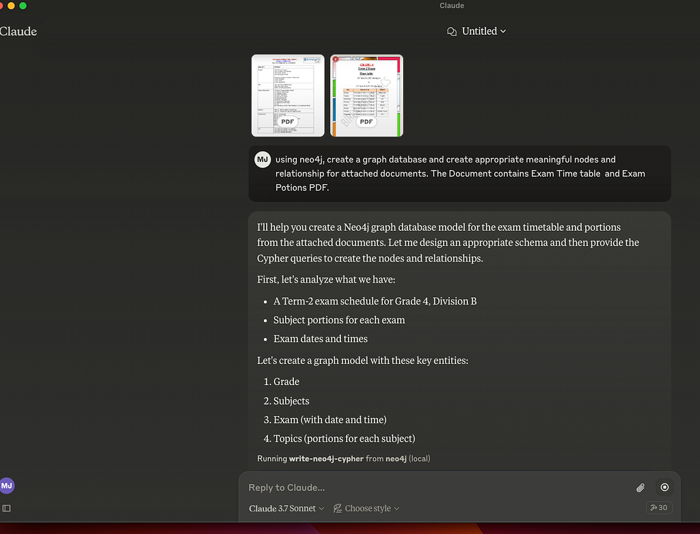

It automatically creates a graph model by analyzing the docs

To access a tool, you have to give it permission, either once or for a whole chat. Therefore, in this case, because I’m updating a database, it’s important to remember that it has full access to my configured database for writes.

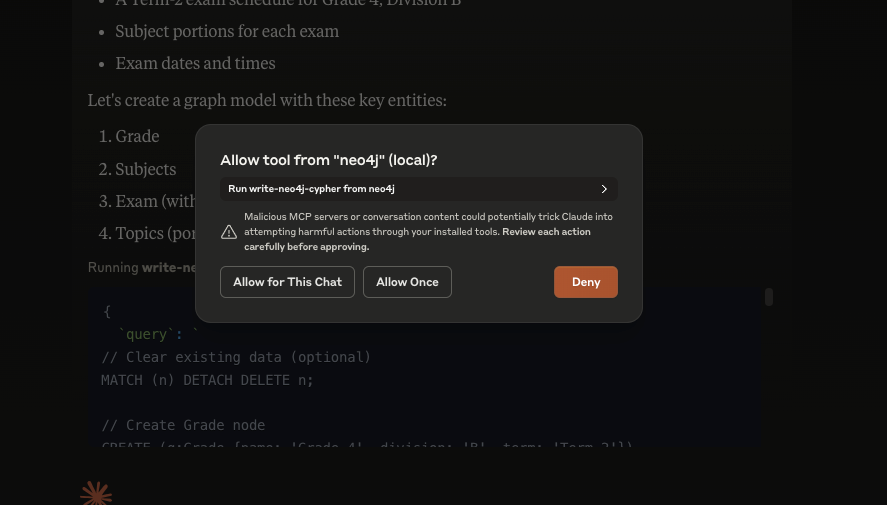

Give permission when asked

Claude then extracts the information from the documents and uses Cypher statements to create the nodes in the database:

* Grade
* Subject(s)
* Exam
* Topics

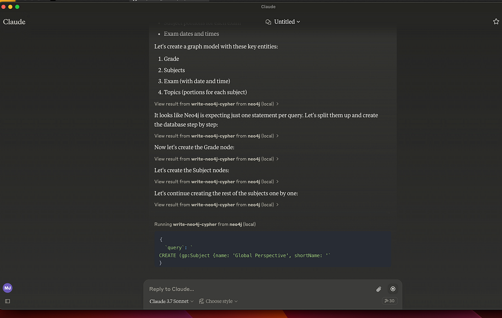

Creating nodes

It iterates over the topics and creates them individually. It would have been more efficient to create them from a list if instructed to do so.

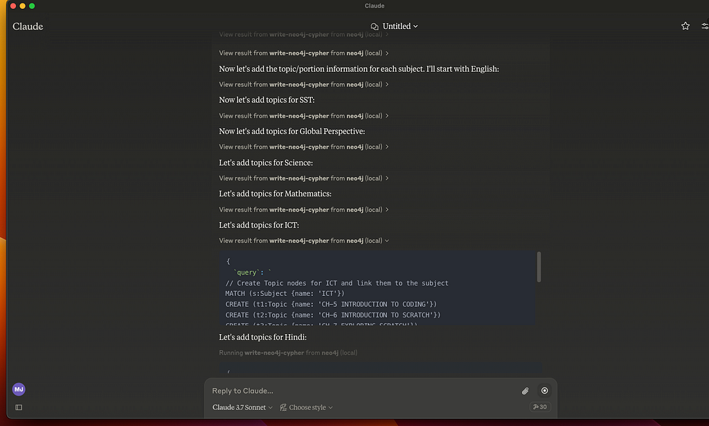

Adding the topics

Claude also creates the relationships between the inserted nodes so we get a full graph structure out of the original PDF documents.

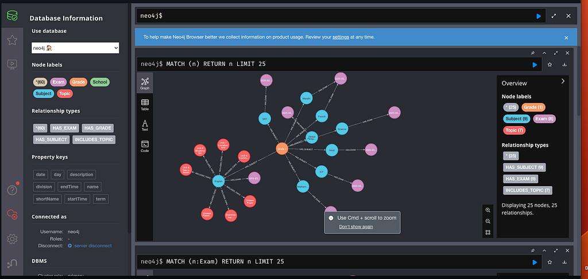

Completed graph with nodes and relationships

### Step 3: Query the Knowledge Graph

Once the database populates, I queried it by asking Claude questions in plain English. For example, when I asked, “When is the English exam and what are the portions?” Claude generated and executed the appropriate Cypher queries and returned:

**English exam:**

* **Date:** Tuesday, March 4, 2025
* **Time:** 11 a.m. to 12 p.m.

**English exam portions:**

1. Unit 6 — Communication
2. Unit 7 — Location and Direction
3. Unit 8 — Take a break
4. Unit 9 — Breaking records
5. Grammar — All topics included in these units
6. Unseen Passage
7. Unseen Poem
8. Picture Description

Behind the scenes, Claude was executing Cypher queries like:

```
// Find when the English exam is scheduled  
MATCH (subject:Subject {name: 'English'})-[:HAS_EXAM]->(exam:Exam)  
RETURN exam.date AS Date, exam.day AS Day, exam.startTime AS StartTime, exam.endTime AS EndTime

// Find the topics/portions for the English exam  
MATCH (subject:Subject {name: 'English'})-[:INCLUDES_TOPIC]->(topic:Topic)  
RETURN topic.name AS Portion


```

But the beauty of this approach is that I never had to write these queries myself. I simply asked Claude for the information I needed.

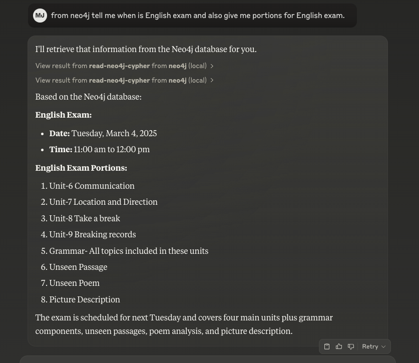

Claude output

Here are some of the original source documents with the information Claude extracted into graph elements.


Original exam schedule PDF

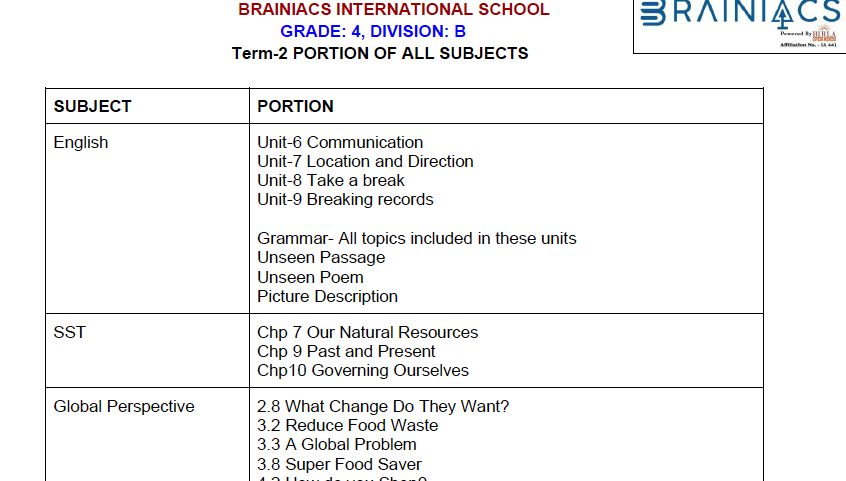

Exam portions PDF

## Visualizing the Knowledge Graph

A powerful aspect of this approach is Claude’s ability to create visualizations of the graph structure. Through our conversation, Claude generated the code and executed it to visualize:

1. A structural schema diagram showing node types and relationships

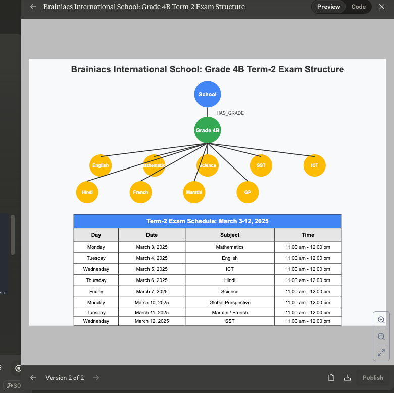

A structural schema diagram showing node types and relationships

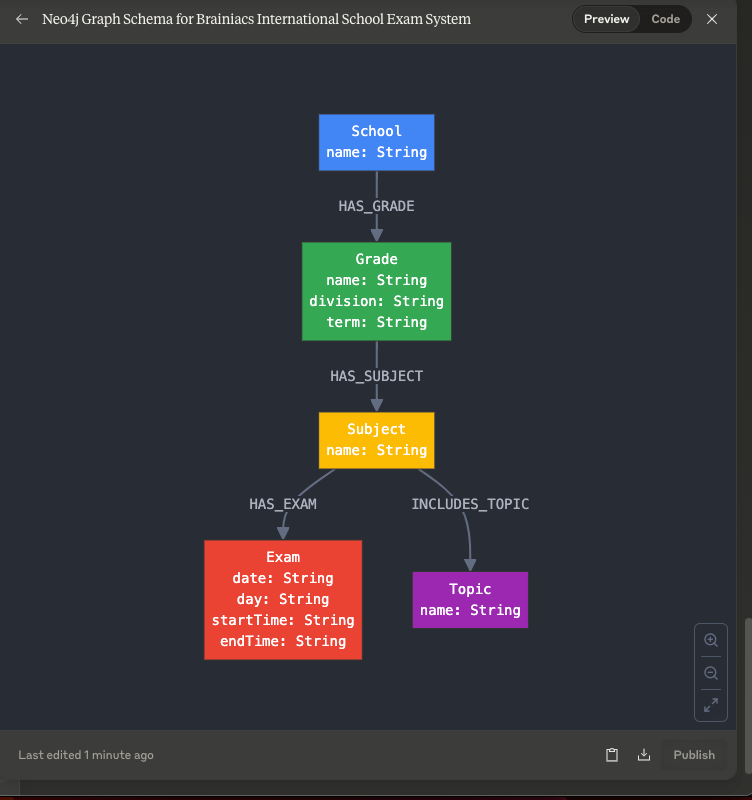

A structural schema diagram showing node types and relationships

2. A graph representation of the grade-subject-exam relationships

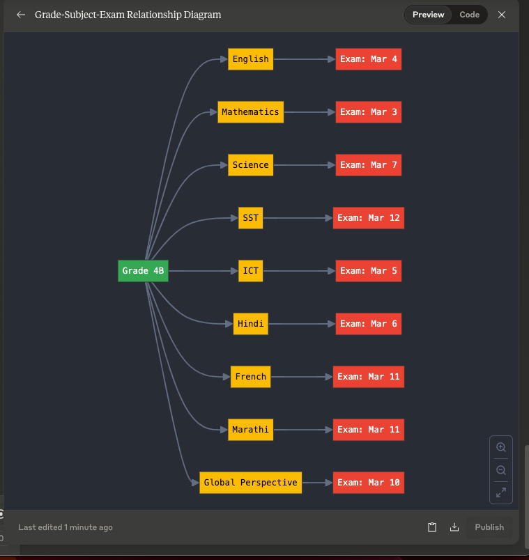

A graph representation of grade-subject-exam relationships

3. A bar chart showing the number of topics per subject

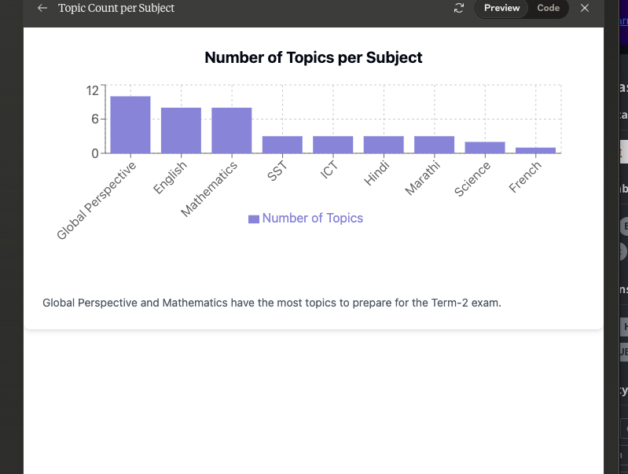

Bar chart showing the number of topics per subject

## Benefits of the No-Code MCP Approach

After completing this project, I found several compelling advantages to using Claude with MCP for Neo4j:

1. **Accessibility** — Graph databases become accessible to non-developers
2. **Speed** — Building complex databases becomes significantly faster
3. **Natural language interface** — Query the database using everyday language
4. **Documentation** — Claude automatically documents the database structure
5. **Visualization**— Helpful visualizations without additional tools
6. **Iterative development** — Easily modify and extend your database through conversation

### Limitations and Considerations

While this approach is powerful, it’s worth noting some limitations:

1. **Complex queries** — Complex query patterns might still benefit from manual optimization.
2. **Security** — Be mindful of the database credentials in your MCP configuration.
3. **Performance** — For large databases, specialized tools might offer better performance.
4. **Validation**— Always validate what the LLM does, during extraction, data creation, querying, and code generation. You’re the expert for your domain and use case and are accountable in the end.

## Summary

The combination of Claude, MCP, and Neo4j represents a significant step toward democratizing graph database technology. By removing the coding barrier, this approach opens up powerful knowledge graph capabilities to a wider audience.

Whether you’re an educator modeling curriculum relationships, a researcher mapping complex networks, or a business analyst visualizing organizational structures, the conversation-driven approach makes graph databases more accessible than ever.

I’m excited to see how this approach evolves and what other complex database tasks will be simplified through AI-assisted, conversation-driven development.

### References

1. <https://modelcontextprotocol.io/introduction>
2. <https://github.com/neo4j-contrib/mcp-neo4j/tree/main/servers/mcp-neo4j-cypher>
3. <https://neo4j.com/developer>
4. <https://neo4j.com/generativeai>
5. <https://neo4j.com/blog/developer/claude-converses-neo4j-via-mcp/>


---

[Building Knowledge Graphs with Claude and Neo4j: A No-Code MCP Approach](https://medium.com/neo4j/building-knowledge-graphs-with-claude-and-neo4j-a-no-code-mcp-approach-830b99b0e35c) was originally published in [Neo4j Developer Blog](https://medium.com/neo4j) on Medium, where people are continuing the conversation by highlighting and responding to this story.

## The Developer’s Guide: How to Build a Knowledge Graph

This ebook gives you a step-by-step walkthrough on building your first knowledge graph.